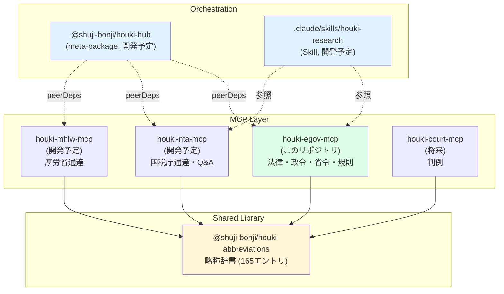

# Houki e-Gov MCP Server

[](https://github.com/shuji-bonji/houki-egov-mcp/actions/workflows/ci.yml)
[](https://www.npmjs.com/package/@shuji-bonji/houki-egov-mcp)
[](LICENSE)
[](https://nodejs.org/)

日本の法令（憲法・法律・政令・省令・規則）を **e-Gov 法令API v2** 経由で取得する MCP サーバ。`houki-hub` MCP family のうち、e-Gov 配下の一次資料を担当する。

略称辞書は [`@shuji-bonji/houki-abbreviations`](https://github.com/shuji-bonji/houki-abbreviations) から取得する。通達・判例等は別 MCP（`houki-nta-mcp` / `houki-mhlw-mcp` / `houki-court-mcp` 等、開発予定）が担当する。

## houki-hub MCP family の中の位置付け



このリポジトリ（緑）が担うのは **e-Gov 法令API のクライアント**機能のみ。各省庁の通達系は別 MCP に分担、共通の略称辞書は `houki-abbreviations` パッケージに分離している。

## 提供ツール

| Tool | 用途 |
|---|---|
| `search_law` | 法令タイトル検索（略称→正式名解決済み） |
| `get_law` | 条/項/号レベル本文取得（Markdown / JSON / TOC） |
| `get_toc` | 目次のみ取得（トークン節約） |
| `get_law_revisions` | 改正履歴取得（公布日・施行日・状態） |
| `search_fulltext` | 全文検索（Phase 2 まで `search_law` にフォールバック） |
| `resolve_abbreviation` | 略称→正式名解決の診断 |
| `explain_law_type` | 法令種別（憲法・法律・政令・省令・通達 等）の解説 |

## このMCPの立ち位置

**LLM 時代の汎用法令リファレンス基盤**。個人学習、フリーランス・個人事業主の実務、そして**プロダクト開発時の法令調査**まで、多岐の分野で使えるノンベンダー個人 OSS として設計しています。

狙いはシンプルで、**エンジニアが法令調査の壁で足止めされず、本来の専門であるプロダクトの品質に時間を使える状態** を作ることです。

### 想定利用シーン

- **エンジニア・プロダクト開発者**：「請求書を電子化して」「本人確認を入れて」「決済を実装して」といった**実装依頼の背後にある法令**（電帳法・電子署名法・犯収法・資金決済法等）の取っ掛かり調査
- **フリーランス・個人事業主**：消費税区分判定・インボイス・青色申告・社保加入要件・**フリーランス新法**対応などの自分の事業に関する調査
- **スタートアップ創業者**：新規事業に必要な業法・許認可の洗い出し
- **プロダクトマネージャ**：利用規約・プライバシーポリシーの叩き台作成、社内法務相談前の論点整理
- **学習者**：法令横断の自習、略称から正式名称への素早いアクセス
- **セカンドオピニオン**：既存の判断（士業・書籍・記事）に対する裏取り

### 権威ではなくセカンドオピニオン

```
┌──────────────────────┬──────────────────────┐
│ 権威レイヤ            │ セカンドオピニオン   │
│ デジタル庁公式 MCP    │ houki-egov-mcp       │
│ LegalOn / MNTSQ 等    │ 他の個人 OSS MCP     │
│ （正しさの基準）      │ （網羅性で補完）     │
└──────────────────────┴──────────────────────┘
               ↓           ↓
        ┌──────────────────────┐
        │ LLM 分析・論点整理   │
        └──────────────────────┘
                    ↓
        ┌──────────────────────┐
        │ 利用者 最終判断と責任 │
        └──────────────────────┘
```

本MCPは **一次情報の取得・提示のみ** を担います。分析は LLM、判断は利用者（または有資格者）の責任です。業としての法律事務・税務業務への利用は**想定外**です — 詳細は [DISCLAIMER.md](DISCLAIMER.md) 参照。

## インストール

### 利用者: Claude Desktop で使う

```json
// claude_desktop_config.json
{
  "mcpServers": {
    "houki-egov": {
      "command": "npx",
      "args": ["-y", "@shuji-bonji/houki-egov-mcp"]
    }
  }
}
```

将来 `houki-nta-mcp` / `houki-mhlw-mcp` がリリースされたら、同じ要領で追加できます。

### 開発者: ローカル開発

```bash
git clone git@github.com:shuji-bonji/houki-egov-mcp.git
cd houki-egov-mcp
npm install
npm run build
npm test
```

```json
// ローカル開発中の動作確認 (.mcp.json)
{
  "mcpServers": {
    "houki-egov-local": {
      "command": "node",
      "args": ["/absolute/path/to/houki-egov-mcp/dist/index.js"]
    }
  }
}
```

## 状態

**v0.2.0 (2026-04-27)** — Architecture E への転換完了

- [x] e-Gov 法令API v2 クライアント（`searchLaws` / `getLawData` / `getLawRevisions`）
- [x] 法令ツリー走査（条/項/号、目次抽出）+ LRU cache
- [x] 7ツール本実装（上記の「提供ツール」表）
- [x] 略称辞書を [`@shuji-bonji/houki-abbreviations`](https://github.com/shuji-bonji/houki-abbreviations) ^0.1.0 に分離
- [x] 法令階層ナレッジ（憲法・法律・政令・省令・規則・条例・告示・訓令・通達・通知 の10種別）
- [x] Trusted Publisher (OIDC) で publish
- [x] テストスイート（**50 tests**）
- [ ] Phase 2: `search_fulltext` 本実装（bulkDL + SQLite FTS5）
- [ ] 漢数字対応（「第三十条」を 30 に変換）
- [ ] 大規模法令の応答サイズ対策（民法・会社法）

### Architecture E ロードマップ

| パッケージ | 役割 | 状態 |
|---|---|---|
| `@shuji-bonji/houki-abbreviations` | 略称辞書（共有ライブラリ） | ✅ v0.1.0 リリース済 |
| `@shuji-bonji/houki-egov-mcp` | e-Gov 法令API クライアント | ✅ v0.2.0（このリポジトリ） |
| `@shuji-bonji/houki-nta-mcp` | 国税庁通達・Q&A・タックスアンサー | 計画中 |
| `@shuji-bonji/houki-mhlw-mcp` | 厚労省通達・通知 | 計画中 |
| `@shuji-bonji/houki-court-mcp` | 判例（裁判所サイト） | 構想中 |
| `@shuji-bonji/houki-saiketsu-mcp` | 国税不服審判所裁決 | 構想中 |
| `@shuji-bonji/houki-hub` | meta-package（一括 install） | 計画中 |
| `.claude/skills/houki-research` | 横断ワークフロー Skill | 計画中 |

詳細は以下を参照：

- [`docs/LAW-HIERARCHY.md`](docs/LAW-HIERARCHY.md) — 法令種別の階層リファレンス
- [`docs/USE-CASES.md`](docs/USE-CASES.md) — プロダクト開発の典型ユースケース（電帳法・電子契約・個情法・e-KYC）
- [`CHANGELOG.md`](CHANGELOG.md) — リリースノート

## デジタル庁公式 MCP との関係

デジタル庁は 2025年12月〜2026年3月の「法令×デジタル」ハッカソンで法令API / MCP のプロトタイプを試行提供した。将来一般公開された場合は、本 MCP のコアを公式 MCP に委譲し、houki ファミリー全体は **公式が手を出さないレイヤ（通達・裁決・判例の横断インデックス、業法対応 Skill 等）** に注力する方針。

## ライセンス

MIT — 個人利用・学習用途のフォーク・改変・再配布を自由に許可します。

ただし、**業としての使用（弁護士法72条・税理士法52条・社労士法27条が定める独占業務）** については想定外であり、作者は一切の責任を負いません。[DISCLAIMER.md](DISCLAIMER.md) を必ずご確認ください。
