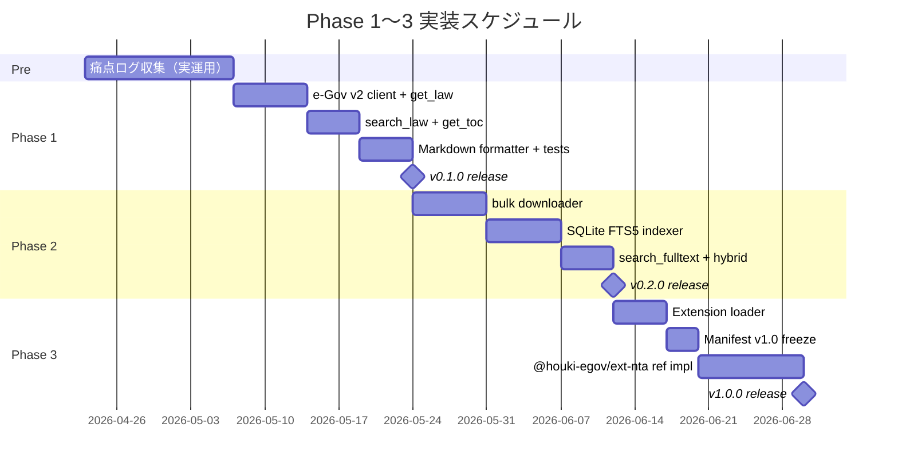
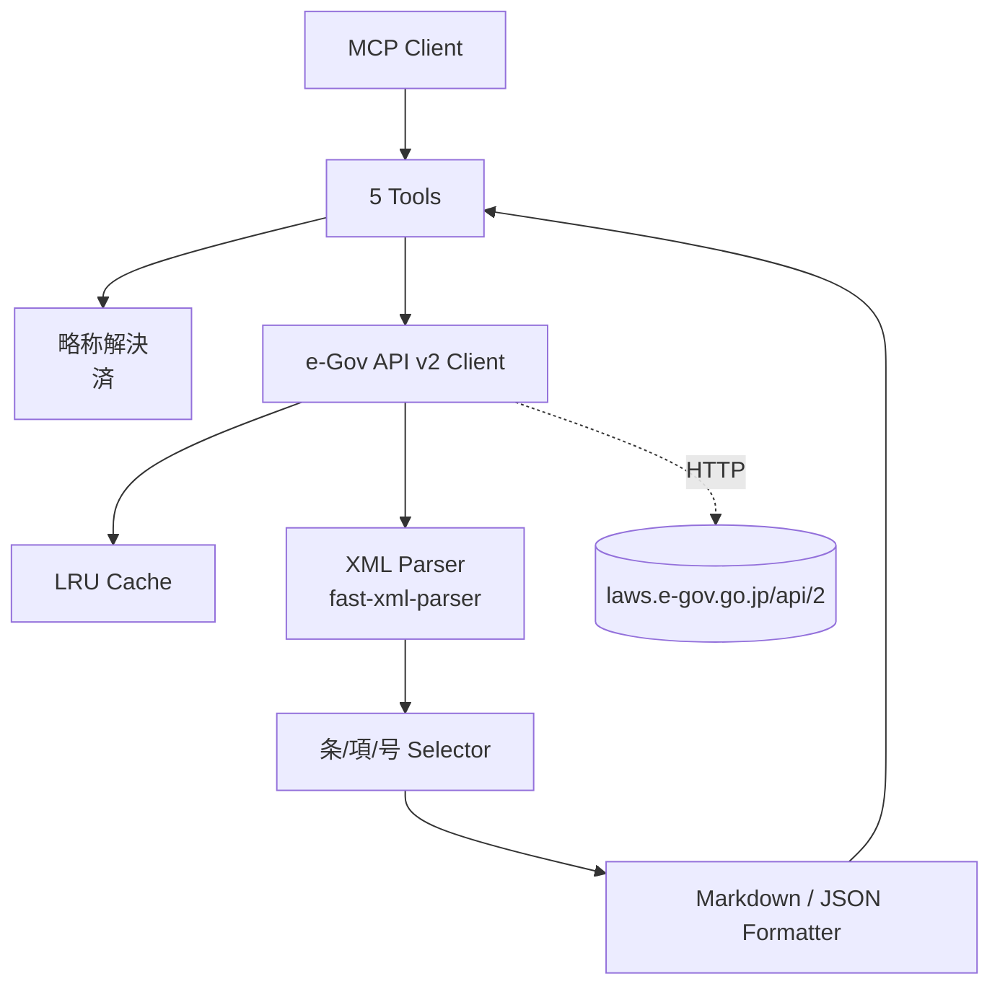
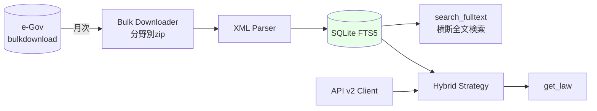

# Implementation Plan — Phase 1〜3

houki-egov-mcp の Phase 1〜3 実装計画。**決めすぎず、足場だけ確実に置く**粒度で書く。実装時に痛点ログ・利用者フィードバックで肉付けする前提。

---

## 全体ロードマップ



各 Phase 終わりに **GitHub Release** を切る。利用者・PR提出者ともに「いまどの段階か」が明示される。

---

## Phase 1 — e-Gov 法令API v2 コア実装

### 目標

5つのコアツールを **e-Gov 法令API v2 を叩く本実装に置き換える**。`resolve_abbreviation` のみ既に動作。`search_fulltext` は Phase 2 まで API フォールバック仕様。

### アーキテクチャ



### ツール仕様

| ツール                 | 入力                              | 内部処理                                                  | 出力                              |
| ---------------------- | --------------------------------- | --------------------------------------------------------- | --------------------------------- |
| `resolve_abbreviation` | 略称                              | 辞書ルックアップ（実装済）                                | 正式名称＋law_id                  |
| `search_law`           | キーワード/略称/分野              | 略称 → 正式名解決 → API 検索                              | 法令一覧（id, title, num, type）  |
| `get_law`              | law_name + 条/項/号 + at          | API → XML パース → セレクタ → Markdown 整形               | 条文本文＋出典URL                 |
| `get_toc`              | law_name + at                     | API → 章節抽出（本文除外）                                | 階層リスト                        |
| `search_fulltext`      | キーワード                        | API 検索フォールバック（Phase 2 で FTS5 化）              | 法令名＋スニペット                |

### データ構造

e-Gov の Standard Law XML を構造化型として扱う：

```typescript
// src/types/law.ts（新規）
interface LawMetadata {
  law_id: string;            // "363AC0000000108"
  title: string;             // "消費税法"
  law_num: string;           // "昭和六十三年法律第百八号"
  law_type: LawTypeCode;
  promulgation_date: string;
  era: 'Meiji' | 'Taisho' | 'Showa' | 'Heisei' | 'Reiwa';
}

interface Article {
  num: string;               // "30" or "30の2"
  caption?: string;          // "(仕入れに係る消費税額の控除)"
  paragraphs: Paragraph[];
}

interface Paragraph {
  num: number;               // 1, 2, ...
  text: string;
  items?: Item[];
}

interface Item {
  num: string;               // "1", "イ", "ロ"
  text: string;
  subitems?: Subitem[];
}

interface LawStructure {
  metadata: LawMetadata;
  parts?: Part[];            // 編
  chapters?: Chapter[];      // 章
  sections?: Section[];      // 節
  articles: Article[];       // 条（直下）
}
```

### 設計の核心

**① XML スキーマへの密着** — e-Gov の Standard Law XML 階層を `interface` で型定義し、セレクタ関数で部分抽出。`Law/LawBody/MainProvision/Part/Chapter/Section/Article/Paragraph/Item/Subitem` のすべてを型化。

**② 時点指定 `at` 対応** — `?lawRevisionId=` または時点パラメータを e-Gov v2 API spec に従って付与。**キャッシュキーに必ず時点を含める**（時点ごとに異なる条文を返すため）。

**③ Markdown 整形ルール**：

```markdown
# {law_title} {article_num}条{paragraph_num}項{item_num}号
（（{caption}））

{text}

---
出典：e-Gov法令検索（デジタル庁）
URL: https://laws.e-gov.go.jp/law/{law_id}
取得日時: {ISO8601}
```

**④ エラー時のフォールバック** — API失敗 → 略称解決の結果＋エラーメッセージ＋手動 e-Gov URL を返す（サーバ落ち時も最低限の価値を保つ）。

### キャッシュ戦略

```typescript
// src/utils/cache.ts は既に config 整備済
// 法令単位（メタ）: 100件 LRU
// 条文単位（部分取得）: 50件 LRU
// 検索結果: 30件 LRU
// キーには at（時点）を含める
```

### エラーハンドリング

| エラー種別            | 対応                                           |
| --------------------- | ---------------------------------------------- |
| HTTP 429 / 5xx        | 指数バックオフで 3回まで再試行                 |
| HTTP 404              | `law_not_found` エラー＋略称辞書のヒントを返却 |
| Timeout (30s)         | abort → エラー＋部分情報＋ e-Gov URL           |
| XML パースエラー      | エラー＋生XML 抜粋（デバッグ用）               |
| API 仕様変更          | parseFailure ログ＋ raw レスポンス保存         |

### 痛点ログ連動ポイント

- 「条/項/号レベルが必要」が高頻度なら `get_law` の階層指定を充実
- 「時点指定が必要」が低頻度なら Phase 1 では簡略化
- 「Markdown より JSON が欲しい」場面の頻度で出力デフォルト決定
- 「特定の検索結果が古い太政官布告ばかり」なら、関連性スコアリングを工夫

### Phase 1 完了条件

- [ ] e-Gov v2 API client 実装＋テスト
- [ ] `get_law` 本実装（条/項/号レベル取得）
- [ ] `search_law` 本実装（略称ヒット → API 結果に絞り込み）
- [ ] `get_toc` 本実装（目次のみ抽出）
- [ ] `search_fulltext` API フォールバック実装
- [ ] 単体テスト 30件以上、統合テスト（実 API 1〜2 件）
- [ ] **README に Phase 1 の使用例**（実際の出力サンプル）
- [ ] **CHANGELOG 更新 + v0.1.0 リリース**

---

## Phase 2 — bulkDL + SQLite FTS5

### 目標

**ローカル ground truth** を確立する。e-Gov XML 一括ダウンロードを取得し、SQLite FTS5 にインデックス化。これが houki-egov の最大の差別化価値。

### アーキテクチャ



### Bulk Downloader

- 配置先：`~/.cache/houki-egov-mcp/bulk/{年月}` に分野別 zip 保存
- 月次の更新検出：HTTP HEAD で `Last-Modified` をチェック
- 失敗時の中断・再開（部分ダウンロード対応）
- 進捗 stderr 出力（dot progress、`tty` 検出で抑制）
- ディスク容量チェック（数百MB 必要）
- **オプトイン**：`HOUKI_HUB_BULK_CACHE=1` でのみ起動

```typescript
// src/services/bulk-downloader.ts（新規）
export async function ensureBulkCache(year: number, month: number): Promise<string> {
  const dir = path.join(getCacheDir(), `${year}-${String(month).padStart(2, '0')}`);
  if (!await needsUpdate(dir)) return dir;
  await downloadAllCategories(dir);
  return dir;
}
```

### SQLite FTS5 スキーマ

```sql
-- メタデータ
CREATE TABLE laws (
  law_id TEXT PRIMARY KEY,
  title TEXT,
  law_num TEXT,
  law_type TEXT,
  promulgation_date TEXT,
  imported_at TEXT
);

-- 条文単位（章・節・条・項・号）
CREATE TABLE articles (
  article_id INTEGER PRIMARY KEY,
  law_id TEXT,
  path TEXT,        -- "第三章/第二節/第三十条/第一項/第一号"
  num TEXT,         -- "30の2"
  paragraph INTEGER,
  item INTEGER,
  text TEXT,
  FOREIGN KEY (law_id) REFERENCES laws(law_id)
);

-- 全文検索用 FTS5 仮想テーブル
CREATE VIRTUAL TABLE articles_fts USING fts5(
  text,
  content=articles,
  content_rowid=article_id,
  tokenize='unicode61 remove_diacritics 1'
);

-- インデックス
CREATE INDEX idx_articles_law_id ON articles(law_id);
CREATE INDEX idx_laws_type ON laws(law_type);
```

### Hybrid Strategy（API/Bulk 二刀流）

| 状況                    | 動作                                                   |
| ----------------------- | ------------------------------------------------------ |
| `BULK_CACHE=0`          | 全ツール API 経由                                      |
| `BULK_CACHE=1`、初回    | バックグラウンド DL（数百MB）。`get_law` は API で動作 |
| `BULK_CACHE=1`、DL済み  | `get_law` は Bulk から即返し、`search_fulltext` は FTS5 |
| Bulk にない法令         | API フォールバック                                     |
| 月次更新検出            | バックグラウンドで差分 DL                              |

### `search_fulltext` 実装

- FTS5 BM25 スコア順
- ハイライト返却（`snippet()` 関数で前後文脈40文字）
- `domain` フィルタ（略称辞書経由で law_id 絞り込み）
- `law_type` フィルタ（メタテーブル JOIN）

```typescript
// 例：消費税の課税仕入れ関連を検索
const results = await db.all(`
  SELECT a.law_id, l.title, a.path, snippet(articles_fts, 0, '<mark>', '</mark>', '...', 20) AS hl
  FROM articles_fts
  JOIN articles a ON a.article_id = articles_fts.rowid
  JOIN laws l ON l.law_id = a.law_id
  WHERE articles_fts MATCH ?
    AND l.law_type = ?
  ORDER BY rank
  LIMIT ?
`, [keyword, lawType, limit]);
```

### 設計の核心

**ローカル ground truth が houki-egov の最大の差別化**。これがあるから：
- e-Gov が落ちても引ける
- 特定条文が消えても検証できる
- 分散保持で改変耐性が成立する
- API レート制限から解放される
- オフラインで動く

### 痛点ログ連動ポイント

- 「全文検索の機会」が低ければ Phase 2 を後回し（Phase 3 と入れ替え）
- 「DB 数百MB は許容できない」なら **分野別オプトイン**（tax だけ・labor だけ等）
- 「最新性が重要」なら更新頻度を週次や日次に短縮

### Phase 2 完了条件

- [ ] Bulk downloader（HEAD 検出 + 再開可能 DL）
- [ ] XML → SQLite インポータ
- [ ] FTS5 スキーマ + マイグレーション
- [ ] `search_fulltext` 本実装
- [ ] Hybrid Strategy（`get_law` の Bulk/API 切替）
- [ ] DB ファイル管理コマンド（`houki-egov-mcp --refresh-cache` 的なもの）
- [ ] 単体テスト + パフォーマンステスト（10万条文での FTS5 検索 < 100ms）
- [ ] **CHANGELOG 更新 + v0.2.0 リリース**

---

## Phase 3 — 拡張レイヤ I/F 確定 & 公式拡張1〜2本

### 目標

通達・裁決などの周辺データソースを **独立 npm パッケージ**として追加できる仕組みを完成させる。Manifest v1.0 を凍結し、リファレンス実装として `@houki-egov/ext-nta`（国税庁通達）を公開する。

### アーキテクチャ

```mermaid
graph TB
    Core[houki-egov-mcp Core] --> Loader[Extension Loader]
    Loader -->|動的 import| Ext1[@houki-egov/ext-nta]
    Loader -->|動的 import| Ext2[@houki-egov/ext-mhlw]
    Loader -->|動的 import| ExtN[他者の拡張]

    Ext1 --> NTA[(国税庁 通達)]
    Ext2 --> MHLW[(厚労省 通達DB)]

    Ext1 -.利用.-> Helpers[Core Helpers<br/>resolveAbbreviation<br/>cache<br/>logger]
    Ext2 -.利用.-> Helpers
    Loader --> Validate[Manifest 検証<br/>tool名衝突チェック]
```

### Extension Loader

```typescript
// src/extensions/loader.ts（新規）
export async function loadExtensions(): Promise<LoadedExtension[]> {
  const packages = RUNTIME_FLAGS.extensions;
  const loaded: LoadedExtension[] = [];

  for (const pkg of packages) {
    try {
      const factory: ExtensionFactory = (await import(pkg)).default;
      const ext = await factory();
      validateManifest(ext.manifest);
      validateNoToolNameCollision(ext.tools, loaded);
      loaded.push({ ...ext, packageName: pkg });
      logger.info('ext', `loaded ${ext.manifest.namespace}: ${ext.tools.length} tools`);
    } catch (err) {
      logger.warn('ext', `failed to load ${pkg}: ${(err as Error).message}`);
      // graceful — ロードできない拡張があってもコアは起動継続
    }
  }
  return loaded;
}
```

### Manifest v1.0 凍結ポイント

Phase 3 で **breaking change なしの v1.0 manifest** を確定：

| 項目                       | 規約                                                       |
| -------------------------- | ---------------------------------------------------------- |
| `manifest.namespace`        | 予約語不可（core, system, mcp 等）。3〜32文字、英数+ハイフン |
| `tools[].name`              | 必ず `{namespace}_*` プレフィックス                        |
| `handlers` の戻り値        | `unknown` を返す（型は extension 側で保証）                |
| `core` への peer dependency | semver `^1.0.0`（メジャー固定）                            |
| エラー時の戻り値           | `{ error: string, isError: true }` の形式に統一            |
| 出典URL                    | 全レスポンスに含めることを推奨（強制ではないがREADME明記） |

### コア → 拡張のヘルパー Export

`@shuji-bonji/houki-egov-mcp/extensions` というサブパスエクスポート経由で、拡張から利用できるユーティリティを公開：

```typescript
// 拡張作者が import できるもの
export { resolveAbbreviation } from '../abbreviations/index.js';
export { logger } from '../utils/logger.js';
export { LRUCache } from '../utils/cache.js';
export { formatArticleMarkdown } from '../formatters/markdown.js';
export type {
  ExtensionFactory,
  ExtensionModule,
  ExtensionManifest,
} from './types.js';
```

`package.json` の `exports` フィールドで sub-path を定義：

```json
{
  "exports": {
    ".": "./dist/index.js",
    "./extensions": "./dist/extensions/public.js"
  }
}
```

### 拡張パッケージのフルリスト（Phase 3 計画）

| パッケージ                | 対象                                          | 主な実務テーマ                                       |
| ------------------------- | --------------------------------------------- | ---------------------------------------------------- |
| `@houki-egov/ext-nta`      | 国税庁 通達・告示・Q&A                        | 電帳法・インボイス・税務全般                         |
| `@houki-egov/ext-mhlw`     | 厚生労働省 通達・告示                         | 労務・社保                                           |
| `@houki-egov/ext-jaish`    | 安全衛生情報センター 通達                     | 労安全衛                                             |
| `@houki-egov/ext-saiketsu` | 国税不服審判所 公表裁決事例                   | 税務争訟                                             |
| `@houki-egov/ext-meti`     | 経済産業省 通達・ガイドライン                 | 電子契約・下請法・産業ガイドライン                   |
| `@houki-egov/ext-soumu`    | 総務省 通達・告示                             | 電子署名・電気通信事業・サイバーセキュリティ         |
| `@houki-egov/ext-moj`      | 法務省 通達・通知                             | 電子契約・登記・会社法・民事                         |
| `@houki-egov/ext-ppc`      | 個人情報保護委員会 ガイドライン・Q&A          | 個情法・マイナンバー                                 |
| `@houki-egov/ext-fsa`      | 金融庁 監督指針                               | 金商法・資金決済・銀行・保険                         |
| `@houki-egov/ext-court`    | 裁判所 判決検索（Stage A/B/C）                | 判例（民事中心）                                     |

### 拡張ツールの統一インターフェース設計

各拡張は **「通達・告示・Q&A・ガイドライン」を統一インターフェース**で提供する。ツール数の爆発を防ぎ、拡張作者の負担を軽減する：

```
{namespace}_search   — キーワード横断検索（type で通達/Q&A/告示等を絞り込み）
{namespace}_get      — 番号・URLで個別取得
{namespace}_list     — カテゴリ別一覧（章・分類）
```

統一仕様：
- `type` パラメータで `'tsutatsu' | 'kokuji' | 'qa' | 'guideline'` を切替
- 全結果に出典 URL と取得日時を付与
- 通達番号・告示番号の正規化（例：`所基通33-6` → `{ tsutatsu: '所基通', section: '33', sub: '6' }`）

### リファレンス実装：`@houki-egov/ext-nta`

最初の公式拡張をフルに作って **拡張作者の手本にする**。

| 項目                  | 内容                                                                  |
| --------------------- | --------------------------------------------------------------------- |
| 対象                  | 国税庁 基本通達（所基通・法基通・消基通・相基通・評基通）＋措置法通達＋取扱通達＋Q&A |
| 取得手段              | NTA サイトのスクレイピング                                            |
| 公開ツール            | `nta_search` / `nta_get` / `nta_list`（type で通達/Q&A 切替）         |
| 通達番号正規化        | 「所基通33-6」→ `{ tsutatsu: '所基通', section: '33', sub: '6' }`     |
| キャッシュ            | 通達は変更頻度低いので **30日 TTL**、Q&Aは年次更新前提で **7日 TTL**   |
| 出典URL               | nta.go.jp の該当ページを必ず返却                                      |
| 既存実装の参考        | `kentaroajisaka/tax-law-mcp` を尊重（ラップでなく独立実装）           |

### 設計の核心

**「コアと拡張の依存方向は一方向のみ」**。コアは拡張の存在を知らない。拡張がコアに依存する。これが守られると：

- コアの単体テスト・単体デプロイが永続的に可能
- デジタル庁公式 MCP への移行時にも拡張だけ残せる
- 第三者が独自の拡張を作っても本家に影響を及ぼさない

### 痛点ログ連動ポイント

- 「実際に通達が必要だった」回数で `ext-nta` の優先度確定
- 「労務系の通達」が多ければ `ext-mhlw` を先行
- 「裁決事例」が多ければ `ext-saiketsu` を先行

### Phase 3 完了条件

- [ ] Extension Loader 実装（環境変数 + 動的 import + 検証）
- [ ] Manifest v1.0 仕様凍結（CONTRIBUTING に明記）
- [ ] `@shuji-bonji/houki-egov-mcp/extensions` sub-path export
- [ ] `@houki-egov/ext-nta` リファレンス実装公開
- [ ] 拡張作者向けドキュメント（examples/ext-template/ の更新）
- [ ] 拡張パッケージのテストガイドライン
- [ ] **CHANGELOG 更新 + v1.0.0 リリース**（Manifest 凍結 = 1.0 を名乗れる）

---

## 横断的な設計原則（全フェーズ共通）

shuji-mcp-patterns 準拠 + houki-egov 固有：

| 原則                          | 内容                                                            |
| ----------------------------- | --------------------------------------------------------------- |
| **判断を返さない**             | コア・拡張ともに事実情報のみ。LLM 側で組み立てる                |
| **出典URL必須**                | 全レスポンスに e-Gov / 各省庁の一次情報URL                      |
| **時点情報の保持**             | レスポンスに `_retrieved_at` を含める（取得時の状態）           |
| **graceful degradation**       | API 失敗・拡張失敗でもコアは死なない                            |
| **観測性**                     | DEBUG=1 で全 API 呼び出しを stderr に。cache hit rate を出せる  |
| **テスト**                     | 単体（vitest）・統合（MCP stdio E2E）・CI マトリクス（Node 20/22） |
| **ハードコード禁止**           | URL・タイムアウト・キャッシュサイズ等は `config.ts` に集約      |
| **ESM `.js` 拡張子**           | TS でも import path に `.js` 必須                               |
| **`console.log` 禁止**         | stdio MCP プロトコル保護のため。logger 経由のみ                 |

---

## バージョニング戦略（Semantic Versioning）

| 変更種別                    | バージョン        | 例                                          |
| --------------------------- | ----------------- | ------------------------------------------- |
| 破壊的変更                  | メジャー（x.0.0） | Manifest v2 / コアAPI 不互換変更            |
| 新機能追加・拡張            | マイナー（0.x.0） | Phase 1 → 0.1.0、Phase 2 → 0.2.0            |
| バグ修正・辞書追加          | パッチ（0.0.x）   | 略称追加・誤字修正                          |
| **Manifest 凍結**            | **1.0.0**         | Phase 3 完了時に到達                        |

`0.x.x` の間は Manifest 仕様が動く可能性あり、と CONTRIBUTING に明記。

---

## 痛点ログとの連動方法

[`docs/PAIN-POINTS-TEMPLATE.md`](PAIN-POINTS-TEMPLATE.md) の2週間トライアル結果が、Phase 1 の MVP スコープと優先順位を決める。

### 痛点 → 機能マッピング例

| 痛点パターン                       | 反映先                                  |
| ---------------------------------- | --------------------------------------- |
| 「特定の条/項/号が引きにくい」     | Phase 1 `get_law` の階層指定強化        |
| 「現代の通称（インボイス等）が引けない」 | 略称辞書の `aliases` に追加          |
| 「全文検索したいが API では遅い」   | Phase 2 を優先実装                      |
| 「通達が並んで欲しい」              | Phase 3 `ext-nta` を優先                |
| 「特定法令を時点指定で見たい」      | Phase 1 `at` パラメータをしっかり実装   |
| 「e-Gov が遅い・落ちる」           | Phase 2 Bulk DL を急ぐ                  |

---

## 関連ドキュメント

- [`README.md`](../README.md) — プロジェクト概要・Quick Start
- [`docs/DESIGN.md`](DESIGN.md) — 設計原則・業法との関係・拡張ロードマップ
- [`docs/PAIN-POINTS-TEMPLATE.md`](PAIN-POINTS-TEMPLATE.md) — 2週間痛点ログテンプレ
- [`DISCLAIMER.md`](../DISCLAIMER.md) — カバレッジ範囲・責任分離
- [`CONTRIBUTING.md`](../CONTRIBUTING.md) — 辞書・拡張・Skill の貢献手順
- [`CHANGELOG.md`](../CHANGELOG.md) — リリースノート

---

## 進め方の心得

> 計画は道具であって枷ではない。  
> 痛点ログが語ることに従って、計画は遠慮なく書き換える。  
> ただし「3層責任分離」「事実提供に徹する」「出典URL必須」の3原則だけは動かさない。
