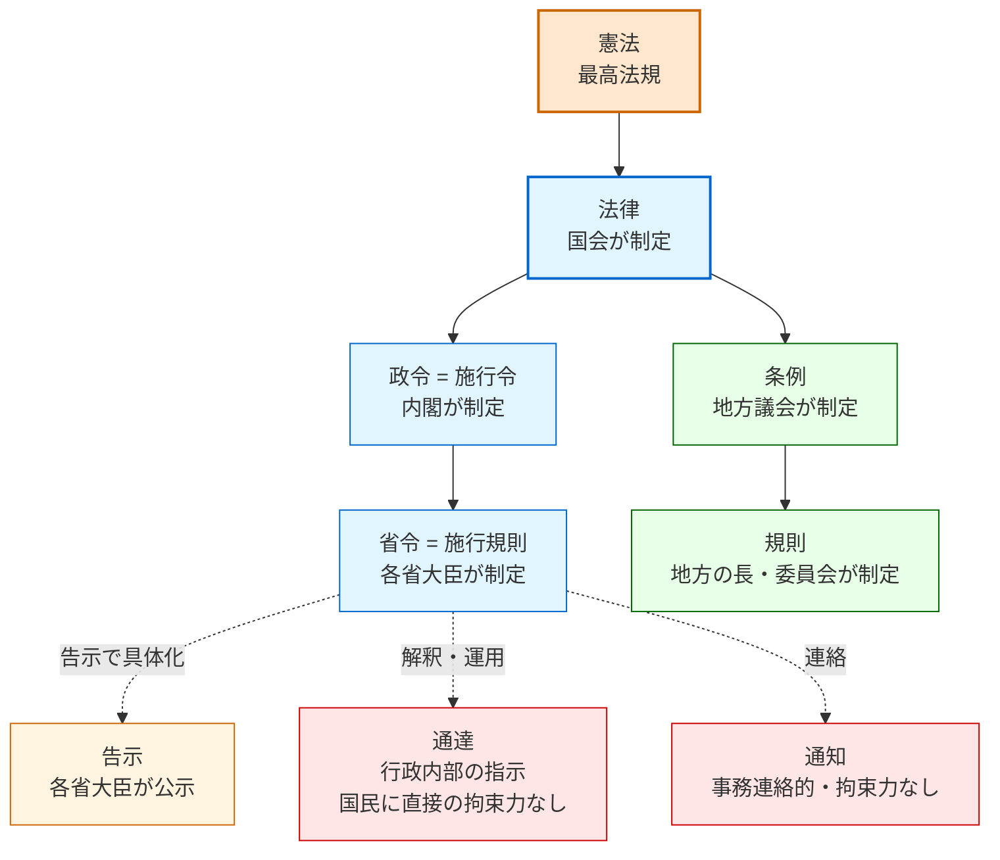
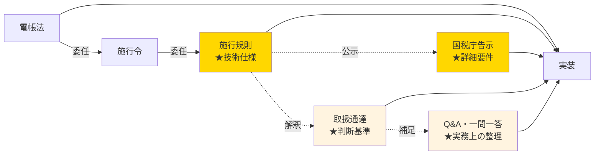

# 法令の種類と階層 — 専門家でない利用者のためのリファレンス

houki-egov-mcp のユーザー（プロダクト開発者・個人事業主・フリーランス）は、法務の専門家ではありません。「政令と省令はどう違う？」「通達は守らなくていい？」といった**基礎の基礎**を、辞書と並ぶナレッジとして提供します。

このドキュメントは [`src/knowledge/law-hierarchy.ts`](../src/knowledge/law-hierarchy.ts) と対になっており、`explain_law_type` ツール経由で LLM もアクセスできます。

---

## 1. 全体像



色分け：
- 🟧 **憲法** — 全てを拘束する最高法規
- 🟦 **国レベルの法令**（法律・政令・省令）
- 🟩 **地方レベルの法令**（条例・規則）
- 🟨 **告示** — 公示的・準法令的
- 🟥 **通達・通知** — 行政内部文書、国民を直接拘束しない

---

## 2. 比較表

| 名称        | 制定主体                   | 階層上の位置        | 国民への拘束力 | 罰則設定 | 主な特徴                                                            | 例                                  |
| ----------- | -------------------------- | ------------------- | -------------- | -------- | ------------------------------------------------------------------- | ----------------------------------- |
| **憲法**     | 国民（国民投票）           | 最高法規            | ✓              | —        | 全ての法令は憲法に違反不可（98条）                                   | 日本国憲法                          |
| **法律**     | 国会                       | 憲法の下位          | ✓              | ✓        | 国民の権利制限・義務の根拠。罰則を設けるには法律の根拠が必要         | 民法・刑法・消費税法                |
| **政令**     | 内閣                       | 法律の下位          | ✓              | △ 委任で可 | 法律の委任に基づき内閣が制定。「○○法施行令」                          | 消費税法施行令                      |
| **省令**     | 各省大臣／内閣府等         | 政令の下位          | ✓              | △ 委任で可 | 法律・政令の委任に基づく。「○○法施行規則」。**実装の具体仕様**はここに | 電帳法施行規則・薬機法施行規則      |
| **規則**     | 最高裁／国会／地方の長 等   | 文脈による          | △              | △ 限定    | 多義語。最高裁規則は法律と同等。地方規則は条例の下位                  | 民事訴訟規則・○○県規則              |
| **条例**     | 地方公共団体の議会         | 法律の下位（地方）  | ✓              | △ 上限あり | 地域独自のルール。法律違反不可。罰則は2年以下の拘禁刑/100万円以下まで | 青少年保護条例・受動喫煙防止条例    |
| **告示**     | 各省大臣／委員会           | 法令と並列・準法令的 | △ ものによる   | —        | 公示形式。法律・政令委任の告示は法的効力あり（例：日本薬局方）        | 国税庁告示・厚労省告示              |
| **訓令**     | 上級行政機関               | 行政内部             | ✗              | —        | 内部命令。事務処理の手順を定める                                     | 各省訓令                            |
| **通達**     | 上級行政機関               | 行政内部             | ✗              | —        | **法令ではない**。行政内部の解釈指針。ただし実務上は無視できない       | 消基通・所基通・電帳法取扱通達      |
| **通知**     | 行政機関                   | 行政内部             | ✗              | —        | 事務連絡的、運用変更の連絡など                                       | 厚労省通知                          |

---

## 3. 国レベルの法令を詳しく

### 憲法

**最高法規**。全ての法令は憲法に違反することはできません（憲法98条）。改正には：
1. 衆参両院で総議員の3分の2以上の賛成
2. 国民投票で過半数の承認

の二段階が必要です（96条）。事実上、改正されたことはありません。

### 法律

**国民の代表である国会が制定**します。罰則を設けるには法律の根拠が必要（罪刑法定主義）。たとえば「特定の行為をしたら懲役○年」と決められるのは、法律以上のレイヤーだけです。

例：消費税法、労働基準法、個人情報保護法

### 政令（＝施行令）

**内閣が法律の委任を受けて制定**する命令。「○○法施行令」と呼ばれます。

法律は抽象的な原則を書き、**政令で具体的な数字や手続を定める**、という分業があります：

```
法律「事業者は届出を行わなければならない」
    ↓ 委任
政令「届出は事業開始から30日以内に主務大臣に提出する」
```

法律の委任なしに新たな権利制限・罰則を設けることはできません（憲法73条6号）。

### 省令（＝施行規則）

**各省大臣が法律・政令の委任を受けて制定**する命令。「○○法施行規則」と呼ばれます。

実装エンジニアが**最もよく参照するレイヤー**で、技術的・細目的な要件はここに書かれていることが多いです：

例：
- 電子帳簿保存法施行規則 → スキャナ保存の解像度・タイムスタンプ要件
- 薬機法施行規則 → 医療機器の分類基準
- 個人情報保護法施行規則 → 安全管理措置の具体内容

「府令」は内閣府の長たる内閣総理大臣が発するもの（金融庁・消費者庁関連等）。実質的に省令と同等。

### 告示

**公示形式の文書**。法令ではありませんが、法律・政令・省令の委任に基づく告示は法的効力を持つことがあります。

例：
- **日本薬局方**（厚生労働省告示） — 医薬品の品質基準。実質的に省令と同等の拘束力
- **電子帳簿保存法関係告示** — 認証要件等
- **保険適用品目** — 健康保険で適用される医薬品の指定

法的位置付けは個別判断が必要です。

### 訓令・通達・通知

これらは**行政機関の内部文書**であって、**法令ではありません**。

| 種類 | 性格                                     |
| ---- | ---------------------------------------- |
| 訓令 | 上級機関が下級機関・職員に発する内部命令 |
| 通達 | 解釈指針・運用指示                       |
| 通知 | 事務連絡・運用変更の連絡                 |

国民への直接の拘束力はないので、「通達違反」で罰せられることはありません。**ただし税務署・労働基準監督署等は通達に従って判断するため、実務上は通達を踏まえないと申請等で不利益**を受けます。

---

## 4. 地方レベルの法令

### 条例

**地方公共団体の議会**が制定する地方独自の法（地方自治法14条）。

- 地域の実情に合わせたルールを定められる
- ただし**法律・政令・省令に違反することはできない**（憲法94条）
- 罰則は **2年以下の拘禁刑または100万円以下の罰金**まで（地方自治法14条3項）
- e-Gov には掲載されない — 各自治体ウェブサイトを参照

例：青少年保護育成条例、迷惑防止条例、受動喫煙防止条例、暴力団排除条例

### 規則（地方）

地方公共団体の**長（知事・市町村長）や行政委員会**が制定。条例の下位。条例の運用に必要な細目を定めることが多いです。

---

## 5. 「規則」は文脈で意味が変わる

「規則」という語は混同されやすいので注意：

| 文脈                       | 意味                                                |
| -------------------------- | --------------------------------------------------- |
| 最高裁判所規則             | 司法手続を定める。**法律と同等の効力**（憲法77条）  |
| 衆議院規則・参議院規則     | 院内手続を定める                                    |
| 人事院規則・会計検査院規則 | 国家公務員制度等の細則                              |
| 地方公共団体の規則         | 条例の下位、地方の首長・委員会が制定                |
| 「○○省規則」              | 省令の別名（混同しやすい）                          |

`get_law` で取得した結果の `law_type` を見るときは、文脈に注意してください。

---

## 6. 実装エンジニアにとっての含意

### 「法律→政令→省令→告示→通達」のたどり方

電子帳簿保存法を実装する場合、**全てのレイヤーを読む必要**があります：



太字★が**実装に直結する**情報源。

### どこで取れるか

| レイヤー   | 取得元                                   | houki-egov-mcp 対応               |
| ---------- | ---------------------------------------- | -------------------------------- |
| 法律       | e-Gov 法令検索                           | Phase 1 コア                     |
| 政令・省令 | e-Gov 法令検索                           | Phase 1 コア                     |
| 告示       | e-Gov（一部）／各省庁／官報              | Phase 1 + 拡張                   |
| 通達       | 各省庁ウェブサイト                       | Phase 3 拡張（ext-nta 等）       |
| Q&A        | 各省庁ウェブサイト                       | Phase 3 拡張                     |
| 条例       | 各自治体ウェブサイト                     | 拡張（将来）                     |

### 「通達違反 = 違法」ではない、しかし「通達無視 = 不利益」

これは混乱しやすい点：

- 通達には**法的拘束力はない**（裁判所も通達には拘束されない）
- だから「通達違反だから無効」とは言えない
- しかし**行政の運用は通達ベース**で行われるため、税務署・労基署等で問題になる

実務的には「**通達は守る前提で動き、争うときは法律レベルで戦う**」のが基本姿勢になります。

---

## 7. ツールから引く

`explain_law_type` ツール経由で、LLM もこの情報を引けます：

```typescript
// 例：政令とは？
explain_law_type({ name: "政令" })
// → { found: true, info: { enacting_body: "内閣", binds_citizens: true, ... } }

// alias も解決
explain_law_type({ name: "施行令" })
// → 政令と同じエントリ

// e-Gov の law_type コードでも引ける
explain_law_type({ name: "Act" })
// → 法律のエントリ
```

---

## 8. 参考：法令の優位性原則

```
憲法
 ↓ 拘束
法律
 ↓ 拘束
政令（施行令）
 ↓ 拘束
省令（施行規則）
 ↓ 拘束
告示
 ↓ 解釈
通達・通知（法令外）
```

下位は上位に違反できません。逆に、上位の法令で**委任されていない事項**を下位の法令で勝手に決めることもできません。

---

## 関連ドキュメント

- [README.md](../README.md) — プロジェクト概要
- [DISCLAIMER.md](../DISCLAIMER.md) — カバレッジ範囲・責任分離
- [docs/DESIGN.md](DESIGN.md) — 設計原則
- [docs/IMPLEMENTATION-PLAN.md](IMPLEMENTATION-PLAN.md) — Phase 1〜3 計画
- [src/knowledge/law-hierarchy.ts](../src/knowledge/law-hierarchy.ts) — 構造化データの実体
