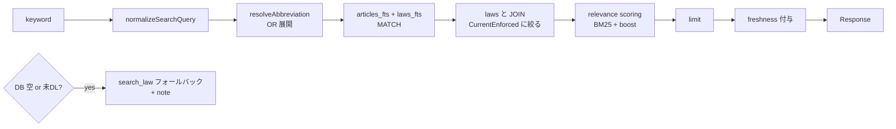

# Phase 2-7 実装計画: search_fulltext の FTS5 接続（v0.5.0）

作成日: 2026-07-19 / 対象バージョン: v0.4.0 → v0.5.0（v0.4.0 は MCP SDK v2 移行に充てたため 1 つ繰り下げ。2026-09-07 実装完了）

> **実装時の差分（2026-09-07）**: trigram tokenizer は 3 文字未満の語を索引しないため、2 文字トークンは「FTS ヒット本文の includes による AND 絞り込み」と「法令名・略称の LIKE 照合」で補う経路を追加した。条番号「第N条」は MATCH 式から外して boost 専用にした。既存 DB は `SCHEMA_VERSION` を 2 に上げて自動初期化する（migration ではなく再 DL）。`HOUKI_HUB_BULK_CACHE` フラグは廃止。

> **番号について**: README/CHANGELOG の「Phase 2-7」は PHASE2-DESIGN.md §9 の **2-11 (search_fulltext 本実装) + 2-12 (relevance scoring)** に相当する。本計画では以後 README 側の「2-7」で呼ぶ。

## 1. ゴール

`search_fulltext` を現在の `search_law` フォールバック（スタブ）から、ローカル SQLite FTS5 を引く本実装に置き換える。nta の完成形（`searchTsutatsu` → `hasAnyClause` ガード → `searchClauseFts` → freshness 埋め込み）をテンプレートとして移植する。



## 2. 現状（2026-07-19 コード監査）

| 部品 | 状態 |
|---|---|
| schema（`articles_fts` external content + trigger 3 本、trigram） | ✅ 完成（`src/db/schema.ts`。**実装は `body`/`body_raw` 列。設計書の `body_normalized` 名は不採用**） |
| ingester（zip→articles、附則 intro / 別表 / 旧法パターン対応） | ✅ 完成。ただし **`body` に normalize 未適用**（`ingester.ts` L203 コメント「Phase 2-11 で対応」、現状 `body === body_raw`） |
| `handleSearchFulltext` | ⛔ スタブ（`handlers.ts` L68-78、search_law フォールバックのみ） |
| MCP server からの DB 接続 | ⛔ なし（DB を開くのは CLI のみ。`openDb` は開くと同時に schema 作成する点に注意 = ファイル有無で DL 済み判定はできない） |
| text-normalize（`normalizeJpText`） | ⛔ egov に未移植（nta `src/services/text-normalize.ts` が移植元） |
| relevance-scoring | ⛔ 未実装（nta `src/services/relevance-scoring.ts` が移植元。**doc_type 重みは法令系では使わない**） |
| freshness | ✅ `summarizeFreshness(db)` が完成済み・流用可 |
| domain フィルタ | ⚠️ `category` 列が全 null（CSV に分野列なし、Phase 2-13 待ち）→ **本リリースでは機能しない旨を明示** |

## 3. 実装ステップ

### Step 1: text-normalize の移植

- 新規 `src/services/text-normalize.ts`
- 選択肢 A: nta からコピー（`normalizeJpText` / `normalizeSearchQuery`）
- **選択肢 B（推奨）: `@shuji-bonji/houki-abbreviations` の `normalizeJpText` / `normalizeSearchQuery` を直接 import**。
  v0.3.0 で共通パッケージに昇格済みであり、egov は既に abbreviations に依存している。独自コピーは持たない
- 採用判断: B。nta も将来 B に寄せる（別 issue）

### Step 2: ingester の `body` normalize 適用

- `src/services/bulk/ingester.ts` L195-206: `insertArticle.run(..., normalizeJpText(a.body_raw), a.body_raw)`
- `laws_fts` 側（title/kana/abbrev）にも同じ normalize を通す（Normalize-everywhere: **DB 投入時と検索時に同一関数**）
- **既存 DB は再 ingest が必要**。migration はせず、`--status` で schema/データ鮮度を見た上で「v0.4.0 では `--bulk-download-everything` の再実行を推奨」と README/CHANGELOG に明記（DB は cache 扱いなので破壊的でない）

### Step 3: 検索層の新設 `src/services/law-search.ts`

nta `db-search.ts` の移植（clause→article 読み替え）:

- `buildSanitizedPhrase` / `sanitizeFtsQuery`: FTS5 メタ文字 `["*:()]` 除去、2 文字未満は空、トークンを `"tok"` AND 結合
- `buildFtsQueryWithAbbreviation(keyword)`: `resolveAbbreviation` が `houki-egov` hint なら `(main) OR (formalPhrase)` に OR 展開。`{query, expandedFrom?, expandedTo?}` を返す
- `searchArticleFts(db, keyword, options): ArticleSearchHit[]`
  ```sql
  SELECT a.law_revision_id, a.article_num, a.caption, a.chapter_path,
         l.law_id, l.law_title, l.law_num, l.law_type,
         snippet(articles_fts, 0, '<b>', '</b>', ' … ', 16) AS snippet,
         articles_fts.rank AS rank
  FROM articles_fts
  JOIN articles a ON a.id = articles_fts.rowid
  JOIN laws l ON l.law_revision_id = a.law_revision_id
  WHERE articles_fts MATCH ?
    AND (l.current_revision_status = 'CurrentEnforced' OR l.remain_in_force = 1)
  ORDER BY articles_fts.rank
  LIMIT ?
  ```
  - **revision 重複対策**: 上記 status フィルタで同一法令の複数 revision ヒットを抑止（設計 §6.1 の肝）
  - re-rank 用に `fetchLimit = min(limit*3, 150)` で多めに取得（nta の RERANK 定数を踏襲）
  - `law_type` 引数があれば `AND l.law_type = ?`
- `searchLawMetaFts(db, keyword)`: `laws_fts` 側の検索（タイトル・略称ヒット）。
  **Article 0 件法令（ImperialOrder 等、本文が articles に入らないケース）はこちらで捕捉**し、`match_type: 'law_meta'` として結果にマージする
- `hasAnyArticle(db)` / `hasAnyLaw(db)`: `SELECT count(*)` による「未 DL」判定（nta `hasAnyClause` 相当）

### Step 4: relevance-scoring の移植（egov 変種）

新規 `src/services/relevance-scoring.ts`。nta 版から:

- 流用: `rankToBaseScore(rank) = 1/(1+10/|rank|)`、`sortByScoreDesc`（score 降順・rank 昇順の安定ソート）、`scoreReasons` の人間可読形式
- **削除: doc_type 重み**（法令に拘束力の階層差はない。PHASE2-DESIGN L430 で確定済み）
- 置換 boost（設計 §6.2）:
  - `law_title === query` → +0.3（`title_exact_match`）
  - 略称/aliases に query が含まれる → +0.2（`abbrev_match`）
  - `caption` に query が含まれる → +0.1（`article_caption_match`）
  - 上限 `min(score, 1.0)`
- 条番号 boost（nta の clause boost 相当）: query 中の「第N条」を `article-num.ts`（既存 util）で正規化し `article_num` 完全一致で +0.3。
  ※ 漢数字（「第三十条」）は既知の未対応領域なので v0.4.0 では算用数字のみ（漢数字対応は別タスク）

### Step 5: handler 本実装

`src/tools/handlers.ts` の `handleSearchFulltext` を置換:

```ts
export async function handleSearchFulltext(args, deps?: { dbPath?: string }) {
  // 1. DB open（deps.dbPath ?? defaultDbPath()）
  // 2. hasAnyArticle(db) が false → closeDb して従来どおり search_law フォールバック
  //    （note: 「bulk DL 未実行。--bulk-download-everything で全文検索が有効になります」）
  // 3. searchArticleFts + searchLawMetaFts → merge → score → slice(limit)
  // 4. freshness = summarizeFreshness(db)（outdated でも警告付きで DB 結果を返す。API に倒さない）
  // 5. { keyword, expanded_keywords?, count, hits, freshness, source: 'bulk' } を返す
  // 6. finally で closeDb
}
```

- `dbPath` 注入は nta の `searchTsutatsu(args, {dbPath})` パターン（テスト容易性）
- レスポンスに `source: 'bulk' | 'api-fallback'` を付ける（Phase 2-13 の `source` フィールド設計を前倒しで導入）
- `RUNTIME_FLAGS.bulkCache`（`HOUKI_HUB_BULK_CACHE`）は**廃止方向**: フラグではなく「DB にデータがあるか」で自動判定する（`hasAnyArticle` ガード）。definitions.ts の description から env 言及を削除
- `domain` 引数: 受け付けるが現状 no-op であることを description に明記（Phase 2-13 で実効化）

### Step 6: テスト

| ファイル | 内容 |
|---|---|
| `src/services/law-search.test.ts`（新規） | `:memory:` + `initSchema` + `ingestZip`（既存 `createMemoryZip` fixture 流用）で: FTS ヒット / OR 展開（略称）/ status フィルタ（PreviousEnforced 除外）/ Article 0 件法令の law_meta 捕捉 / sanitize（メタ文字・2 文字未満） |
| `src/services/relevance-scoring.test.ts`（新規） | nta 同名テストをモデルに boost 4 種 + 安定ソート |
| `src/tools/handlers.test.ts`（追記） | 空 DB → search_law フォールバック + note / データあり → bulk 結果 + freshness / `dbPath` 注入 |
| `src/services/bulk/ingester.test.ts`（追記） | `body` が normalize 済み・`body_raw` が原文のままであること |

### Step 7: リリース

1. CHANGELOG `[0.4.0]`: Added（search_fulltext FTS5 本実装、relevance scoring、source フィールド）/ Changed（body normalize → 再 DL 推奨）/ Removed（HOUKI_HUB_BULK_CACHE フラグ）
2. README のツール表・「計画中」欄を更新（2-7 を完了に）
3. `npm version minor` → tag push → publish（OIDC）

## 4. 作業順序と規模


規模感: nta に完成形があるため大半が移植。新規設計が要るのは「revision 重複対策」と「law_meta マージ」の 2 点のみ。

## 5. 完了判定

- [ ] bulk DL 済み DB で `search_fulltext("インボイス")` が条文ヒットを返す（OR 展開込み）
- [ ] 未 DL 環境では従来どおり search_law フォールバック + 誘導 note
- [ ] 同一法令の複数 revision が重複ヒットしない
- [ ] Article 0 件法令がタイトル検索で捕捉される
- [ ] `score` / `scoreReasons` / `freshness` / `source` がレスポンスに含まれる
- [ ] 全テスト緑（193 + 新規 ≈ 220 前後）

## 6. スコープ外（後続）

- Phase 2-8: 差分同期（`file_section=3&update_date` 日次ループ）— 本実装の次
- Phase 2-13: category/domain 実効化、revisions_meta enrichment
- Phase 2-14: `get_law` / `get_toc` の bulk 化
- 漢数字対応（「第三十条」→30）: houki-abbreviations の `normalizeLawNum` 設計（別計画書参照）と統合的に扱う
