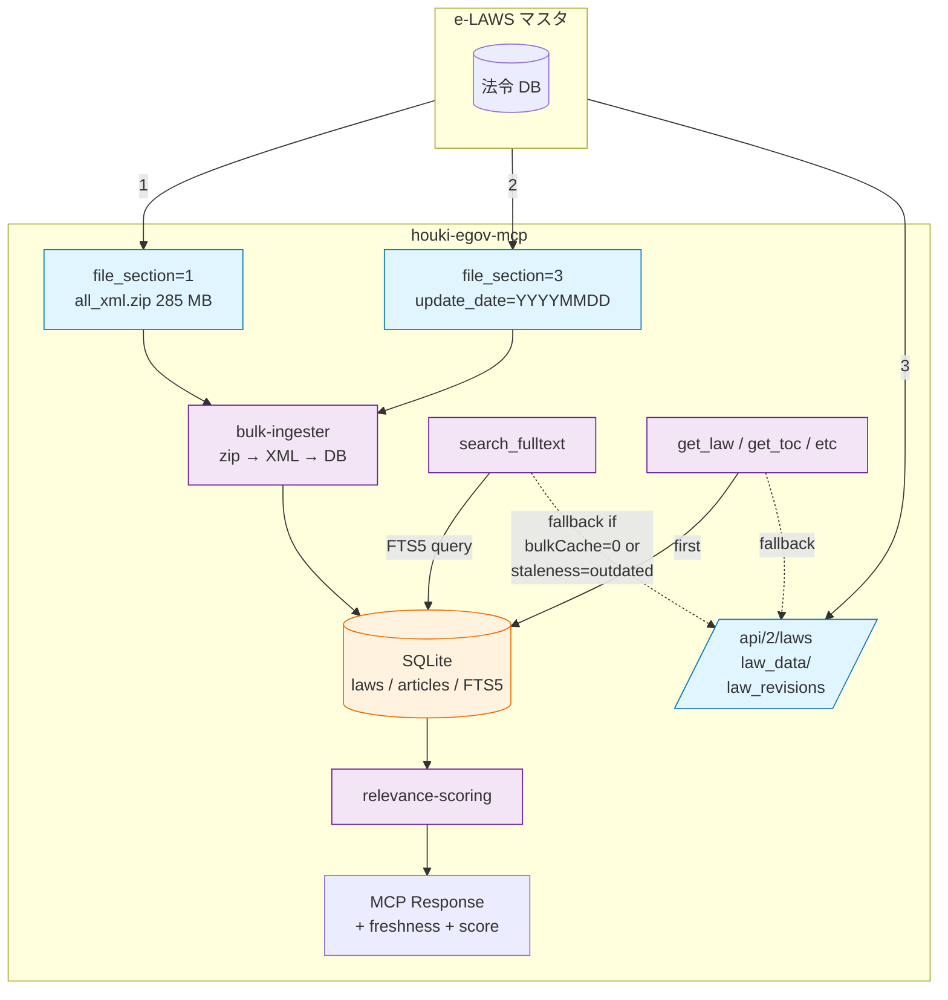
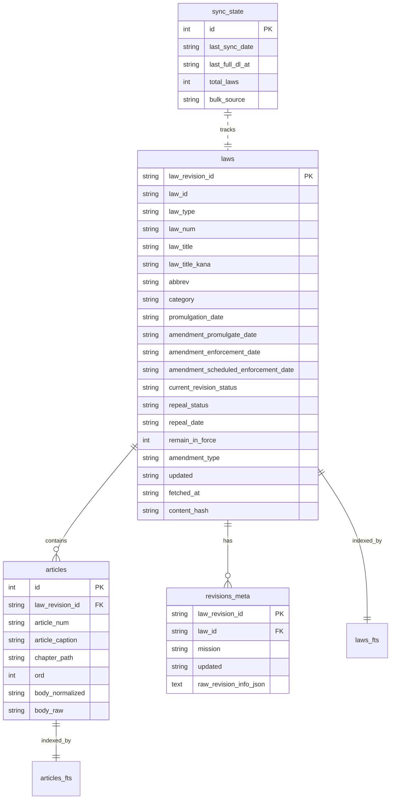
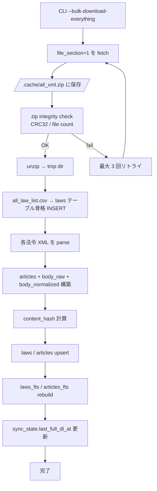
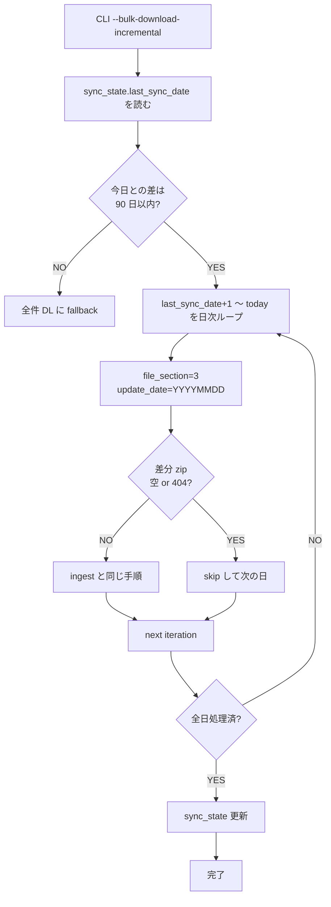
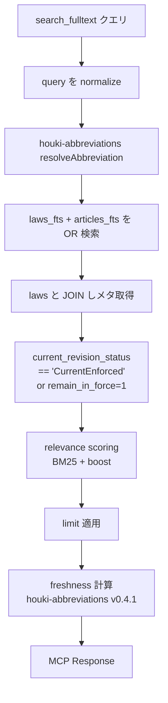
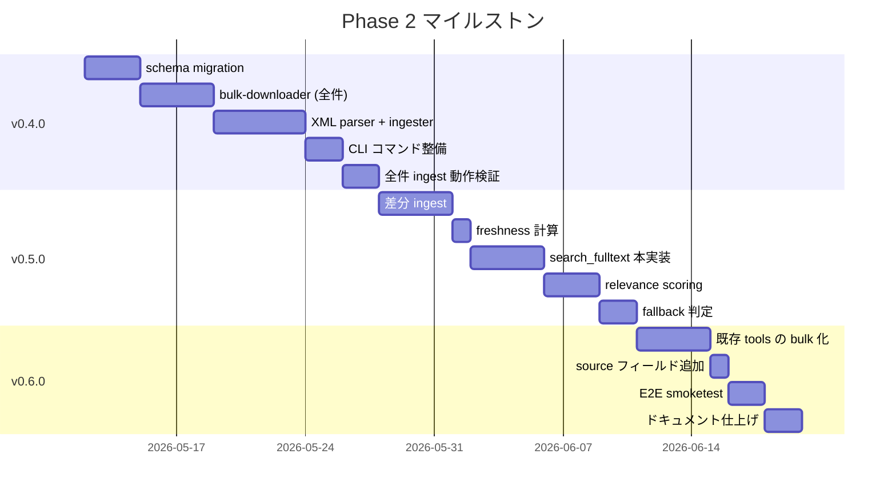
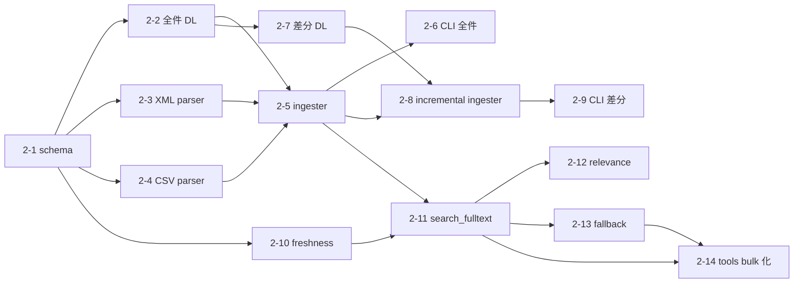

# Phase 2 Design — bulk DL + SQLite FTS5

**最終更新:** 2026-05-09
**前提資料:**

- [PHASE2-SPIKE.md](./PHASE2-SPIKE.md) — bulk DL 仕様 / API ライフサイクル実証
- [PHASE2-SPIKE-FOLLOWUP.md](./PHASE2-SPIKE-FOLLOWUP.md) — Range / 未施行・廃止 / FTS5 粒度の追加実証
- [DESIGN.md](./DESIGN.md) — houki-egov-mcp 全体設計

houki-egov-mcp は v0.3.0 時点で **e-Gov 法令API v2 を経由した条文取得** を提供している。Phase 2 は **bulk DL + SQLite FTS5** によりオフライン・横断検索を実現し、`search_fulltext` を本実装する。houki-nta-mcp の Phase 6-2 で確立した「差分 bulk DL + content_hash + freshness」パターンを e-Gov 流に適応する位置づけ。

## 1. ゴールと非ゴール

### 1.1 ゴール

1. **`search_fulltext` の本実装** — オフラインで全 10,000+ 法令を横断検索できる
2. **差分取得による日次同期** — `file_section=3&update_date=YYYYMMDD` で過去 3 ヶ月分の変更を追える
3. **`law_revision_id` を主キーにした履歴対応** — UnEnforced / Repeal / 経過措置を区別して扱う
4. **API フォールバック維持** — bulk DB が古い場合・bulk OFF 時は API に倒す
5. **freshness シグナルの返却** — houki-nta-mcp v0.9.3 と同じ `StalenessLevel` を MCP レスポンスに付ける

### 1.2 非ゴール（Phase 2 ではやらない）

- 法令本文の意味解析・自動分類（条 ↔ 条の参照解決など）
- 改正の差分テキスト生成
- 別表 (AppdxTable) の表構造の精密検索（FTS5 では本文のみ）
- API v1 互換層（v2 一本でいく）
- 法令 XML スキーマの独自拡張・正規化
- 公式 swagger に出ていない裏 API の探索

## 2. 全体アーキテクチャ



### 2.1 spike + follow-up からの設計柱

| # | 柱 | 根拠 |
|---|---|---|
| A | **HTTP 304 / Range は使わない** | spike §1-2, follow-up §1-2 で完全無視を実証 |
| B | **`update_date` 日次差分が中核** | spike §3 で過去 3 ヶ月分まで再取得可能を実証 |
| C | **`law_revision_id` 主キー** | follow-up §2-5 で API ⊇ bulk の identity 一致を実証 |
| D | **ステータスは 2 軸** (`current_revision_status` × `repeal_status`) | follow-up §2-1 で値分布実測 |
| E | **`mission` は使わない** | follow-up §2-4 で 100% `New` を実証 |
| F | **FTS5 は Article 単位主 + laws 単位従** | follow-up §3-4 で 235 万 Article 規模と検索 UX のトレードオフ |
| G | **tokenizer は houki-nta-mcp と統一** (`trigram`) | family-wide consistency。`unicode61` は CJK を 1 トークン扱いするため日本語部分一致が不可、`trigram` は 3-gram で部分一致を取れる (実機で確認済み) |
| H | **freshness 判定は houki-abbreviations v0.4.1** | houki-nta-mcp v0.9.3 で確立、再利用 |

## 3. DB schema 確定版

### 3.1 全体構造



### 3.2 SQL 完全定義

```sql
-- ===== Laws (1 行 = 1 revision) =====
CREATE TABLE laws (
  law_revision_id TEXT PRIMARY KEY,                  -- '346AC0000000034_20260507_508AC0000000015'
  law_id TEXT NOT NULL,                              -- '346AC0000000034'
  law_type TEXT NOT NULL,                            -- 'Act' | 'CabinetOrder' | 'Rule' | 'Regulation' | ...
  law_num TEXT NOT NULL,                             -- '昭和四十六年法律第三十四号'
  law_title TEXT NOT NULL,
  law_title_kana TEXT,
  abbrev TEXT,
  category TEXT,                                     -- '金融・保険' (e-Gov 42 カテゴリ)

  promulgation_date TEXT NOT NULL,                   -- '1971-04-01' (ISO date)
  amendment_promulgate_date TEXT,                    -- '2026-05-07'
  amendment_enforcement_date TEXT,                   -- '2026-05-07'
  amendment_scheduled_enforcement_date TEXT,         -- UnEnforced で予告日のあるもの

  -- ステータス系 (follow-up §2-1 の実測値域)
  current_revision_status TEXT NOT NULL
    CHECK (current_revision_status IN
      ('CurrentEnforced', 'UnEnforced', 'PreviousEnforced', 'Repeal')),
  repeal_status TEXT NOT NULL
    CHECK (repeal_status IN ('None', 'Repeal', 'LossOfEffectiveness', 'Expire')),
  repeal_date TEXT,
  remain_in_force INTEGER NOT NULL DEFAULT 0,        -- 0/1 (廃止後も部分効力)
  amendment_type TEXT,                               -- '1' | '3' | '8'

  -- 同期メタ (houki-nta-mcp Phase 6-2 と統一)
  updated TEXT NOT NULL,                             -- API revision_info.updated (ISO 8601)
  fetched_at TEXT NOT NULL,                          -- DB 投入時刻 (ISO 8601)
  content_hash TEXT NOT NULL                         -- 本文 SHA-256 (差分検知用)
);
CREATE INDEX idx_laws_law_id ON laws(law_id);
CREATE INDEX idx_laws_status ON laws(current_revision_status, repeal_status);
CREATE INDEX idx_laws_enforce ON laws(amendment_enforcement_date);
CREATE INDEX idx_laws_updated ON laws(updated);

-- ===== Articles (1 行 = 1 条 or 別表 1 つ) =====
CREATE TABLE articles (
  id INTEGER PRIMARY KEY,
  law_revision_id TEXT NOT NULL REFERENCES laws(law_revision_id) ON DELETE CASCADE,
  article_num TEXT NOT NULL,                         -- '1' | '12_2' (12 条の 2) | 'Appendix1' (別表)
  article_caption TEXT,                              -- '（目的）'
  chapter_path TEXT,                                 -- '第二章 第一節' のパス文字列
  ord INTEGER NOT NULL,                              -- 法令内ソート順
  body_raw TEXT NOT NULL,                            -- Sentence 結合した生本文
  body_normalized TEXT NOT NULL                      -- houki-abbreviations の normalize 適用済み
);
CREATE INDEX idx_articles_law ON articles(law_revision_id, ord);
CREATE INDEX idx_articles_num ON articles(article_num);

-- ===== FTS5 ===== (法令メタ検索 + 本文検索の 2 段)
CREATE VIRTUAL TABLE laws_fts USING fts5(
  law_revision_id UNINDEXED,
  law_title,
  law_title_kana,
  abbrev,
  law_num,
  category,
  tokenize = 'trigram'
);

CREATE VIRTUAL TABLE articles_fts USING fts5(
  article_id UNINDEXED,
  body,                                              -- body_normalized
  caption,                                           -- article_caption
  tokenize = 'trigram'
);

-- ===== 全 revisions のメタ (履歴) =====
-- API /law_revisions/{lawId} で取れる全履歴を補助保存
CREATE TABLE revisions_meta (
  law_revision_id TEXT PRIMARY KEY,
  law_id TEXT NOT NULL,
  mission TEXT,                                       -- 100% 'New' だが将来仕様変更に備え保存
  updated TEXT NOT NULL,
  raw_revision_info_json TEXT NOT NULL                -- 全フィールドを JSON で保存 (forward compat)
);
CREATE INDEX idx_revmeta_law ON revisions_meta(law_id);

-- ===== 同期状態 =====
CREATE TABLE sync_state (
  id INTEGER PRIMARY KEY CHECK (id = 1),              -- single-row table
  last_sync_date TEXT NOT NULL,                       -- '2026-05-07' (ISO date)
  last_full_dl_at TEXT NOT NULL,                      -- '2026-05-01T00:00:00+09:00'
  total_laws INTEGER NOT NULL DEFAULT 0,
  bulk_source TEXT NOT NULL DEFAULT 'all_xml',        -- 'all_xml' | 'incremental'
  schema_version INTEGER NOT NULL DEFAULT 1
);
```

### 3.3 schema 設計判断 (WHY)

| 判断 | 理由 |
|---|---|
| **`law_revision_id` を PK** | follow-up §2-5。1 法令あたり複数 revision (CurrentEnforced 1 + UnEnforced N + PreviousEnforced 多) を区別する必要があり、`law_id` は重複する |
| **`mission` は revisions_meta に逃がす** | follow-up §2-4 で 100% `New` だが、forward compat のため raw JSON で保持 (将来 e-Gov が値域を増やしても破壊なし) |
| **`articles.body_raw` と `body_normalized` の二重保存** | 検索は `body_normalized` で行い、結果表示は `body_raw` を返す。houki-nta-mcp Normalize-everywhere パターン |
| **`articles_fts` と `laws_fts` の 2 段** | follow-up §3-4。法令名検索（タイトル / 略称 / 番号）と本文検索でクエリ意図が違う |
| **`content_hash` を laws に持つ** | 差分 zip で同じ revision_id が来た時、本文未変更なら no-op にする (houki-nta-mcp Phase 6-2 と同じ) |
| **`sync_state` は single-row** | プロセスごとに同期状態は 1 つだけ。`CHECK (id = 1)` で誤多重挿入を防ぐ |

## 4. CLI コマンド体系

houki-nta-mcp の `--bulk-download-everything` / `--bulk-download-incremental` を踏襲。CLI は MCP server 起動と独立に動かせる。

```bash
# 1) 初回 / 全件再構築
houki-egov --bulk-download-everything
# → file_section=1 全件 zip DL → DB 全件 rebuild → laws_fts / articles_fts 再構築

# 2) 日次差分 (cron 用)
houki-egov --bulk-download-incremental
# → sync_state.last_sync_date 〜 today を file_section=3 で日次取得 → 差分 ingest

# 3) 特定日の差分のみ
houki-egov --bulk-download-by-date 20260507
# → file_section=3&update_date=20260507 を 1 回だけ実行 (デバッグ用)

# 4) FTS5 のみ再構築 (法令メタは触らない)
houki-egov --rebuild-fts

# 5) 特定法令を API から強制取得
houki-egov --refresh-law 346AC0000000034
# → /api/2/law_data/346AC0000000034 を呼び DB upsert (bulk が古い時の手動更新)

# 6) 状態確認
houki-egov --status
# → sync_state, laws 件数, FTS5 サイズ, freshness を出力

# 7) MCP server (デフォルト)
houki-egov
```

### 4.1 環境変数

| 変数 | デフォルト | 用途 |
|---|---|---|
| `HOUKI_HUB_BULK_CACHE` | `0` | `1` で bulk DB を使用 (既に config.ts に存在) |
| `HOUKI_EGOV_DB_PATH` | `~/.cache/houki-egov-mcp/laws.db` | DB ファイルパス |
| `HOUKI_EGOV_BULK_RETRY` | `3` | 全件 DL 失敗時のリトライ回数 |
| `HOUKI_EGOV_INCREMENTAL_LIMIT_DAYS` | `90` | 差分の最大遡及日数 (3 ヶ月) |
| `HOUKI_EGOV_CONCURRENCY` | `4` | API 同時呼び出し上限 (既存) |

## 5. 取り込みパイプライン

### 5.1 全件 ingest



擬似コード:

```typescript
async function bulkDownloadEverything(db: Database) {
  const tmpDir = await fs.mkdtemp('houki-egov-bulk-');
  try {
    const zipPath = path.join(tmpDir, 'all_xml.zip');
    await downloadWithRetry({
      url: `${EGOV_BULK.indexUrl}?file_section=1&only_xml_flag=true`,
      dest: zipPath,
      maxRetries: env.HOUKI_EGOV_BULK_RETRY,
      expectedBytes: 290_000_000, // PHASE2-SPIKE 実測ベース
    });

    await verifyZipIntegrity(zipPath);
    await unzip(zipPath, tmpDir);

    const csv = await parseCsv(path.join(tmpDir, 'all_law_list.csv'));
    db.transaction(() => {
      for (const row of csv) {
        // 列 12 = 法令ID, 列 13 = 本文URL から revision_id を導出
        const revisionId = extractRevisionIdFromUrl(row['本文URL']);
        const xmlPath = findXmlPath(tmpDir, row['法令ID'], revisionId);
        const xml = await fs.readFile(xmlPath, 'utf-8');
        const parsed = parseLawXml(xml);

        upsertLaw(db, { ...row, ...parsed, content_hash: sha256(xml) });
        upsertArticles(db, revisionId, parsed.articles);
      }
    })();

    await rebuildFtsIndexes(db);
    await updateSyncState(db, {
      last_sync_date: today(),
      last_full_dl_at: new Date().toISOString(),
      bulk_source: 'all_xml',
      total_laws: csv.length,
    });
  } finally {
    await fs.rm(tmpDir, { recursive: true, force: true });
  }
}
```

### 5.2 差分 ingest



### 5.3 XML パースの方針

`Law > LawBody > MainProvision > Article > Paragraph > Sentence` の階層を **再帰的に flatten** して `articles` テーブルに 1 行ずつ挿入。各 article の本文は **その article 配下の全 Sentence を結合** (改行区切り)。

```typescript
// 例: 預金保険法 第二条
{
  article_num: '2',
  article_caption: '（定義）',
  chapter_path: '第一章 総則',
  ord: 2,
  body_raw: 'この法律において、次の各号に掲げる用語の意義は、当該各号に定めるところによる。\n一 金融機関 ...',
}
```

### 5.4 別表の扱い

`AppdxTable` は article と同じ粒度で `articles` テーブルに INSERT、`article_num='Appendix1'`, `'Appendix2'`, ... と prefix を付けて識別。本文は TableRow / TableColumn を `\n` / `\t` 区切りで一旦 flatten。表構造の精密検索は Phase 2 では取らない。

### 5.5 SupplProvision (附則) の扱い

`SupplProvision` 配下の Article も `articles` テーブルに INSERT。`article_num` に `Suppl1_1`, `Suppl1_2`, ... と prefix。本則 article と区別したい場合のために `chapter_path` に `附則 (令和八年法律第十五号)` のように付与。

## 6. 検索パイプライン

### 6.1 search_fulltext の処理フロー



### 6.2 relevance scoring (houki-nta-mcp と同じ系譜)

```typescript
type ScoreReason =
  | { kind: 'bm25'; value: number }
  | { kind: 'title_exact_match'; boost: number }
  | { kind: 'abbrev_match'; boost: number }
  | { kind: 'article_caption_match'; boost: number };

function computeScore(hit: RawHit, query: NormalizedQuery): number {
  let score = bm25NormalizeRank(hit.bm25);
  if (hit.law_title === query.original) score += 0.3;
  if (hit.abbrev && query.original.includes(hit.abbrev)) score += 0.2;
  if (hit.article_caption?.includes(query.original)) score += 0.1;
  return Math.min(score, 1.0);
}
```

houki-nta-mcp の `src/services/relevance-scoring.ts` とほぼ同じ実装。**法令系では doc_type 重み付け不要** (法令 / 政令 / 省令の 3 種だが法的拘束力の優先順位は文脈依存) なので、これは入れない。

### 6.3 API フォールバックの判定

```typescript
async function searchFulltext(query: string, opts: SearchOpts) {
  if (!RUNTIME_FLAGS.bulkCache) {
    // bulk OFF: 旧来通り search_law (タイトル一致) にフォールバック
    return searchByTitleViaApi(query, opts);
  }

  const freshness = await getFreshness(db);
  if (freshness.staleness === 'outdated') {
    // 30 日以上古い: 警告メッセージを付けて bulk DB の結果を返す
    // (API に倒すと 1 リクエストで済まないので運用判断で保留)
  }

  const hits = await searchInBulkDb(db, query, opts);
  return { hits, freshness };
}
```

### 6.4 既存ツール (`get_law` / `get_toc` / `find_law_article`) の bulk 化

bulkCache 有効時は **DB 優先 → 失敗時 API フォールバック** に切替:

```typescript
async function getLaw(lawId: string) {
  if (RUNTIME_FLAGS.bulkCache) {
    const fromDb = await getLawFromDb(db, lawId);
    if (fromDb) return { ...fromDb, source: 'bulk' };
  }
  const fromApi = await fetchLawDataFromApi(lawId);
  return { ...fromApi, source: 'api' };
}
```

各ツールの応答に **`source: 'bulk' | 'api'`** を付与 (既存契約に追加)。LLM はこれで「最新性が必要なら api を信じる」判断ができる。

## 7. テスト戦略

### 7.1 ユニットテスト (vitest)

| 対象 | 内容 |
|---|---|
| `services/bulk/csv-parser.test.ts` | all_law_list.csv の 14 列パース、和暦変換 |
| `services/bulk/xml-parser.test.ts` | 法令 XML → articles 配列の構築。fixture: 短い法令 (改暦ノ布告) と長い法令 (預金保険法 第一条のみ) |
| `services/bulk/ingester.test.ts` | in-memory DB に 5 法令分 ingest し、laws / articles / FTS5 が期待通りか |
| `services/bulk/incremental.test.ts` | sync_state を fixture に合わせ、`update_date` ループの正常 / 空 / 90 日超 fallback パスを網羅 |
| `services/relevance-scoring.test.ts` | houki-nta-mcp の同名テストを model に、boost ロジックの単体テスト |
| `tools/handlers.test.ts` | search_fulltext の bulk / api フォールバック分岐 |

### 7.2 fixtures

`tests/fixtures/bulk/`:
- `mini-all-xml.zip` — 5 法令 + CSV を含む小さな zip (生成スクリプト同梱)
- `diff-20260507.zip` — spike で取得した実物 (小さい)
- `law-yokin.xml` — 預金保険法の本文 (実物)

### 7.3 E2E スモーク

実 e-Gov に当てるスモークは CI から外し、開発手元で叩く `scripts/smoke-bulk.sh` を用意:

```bash
# 全件 DL → 1000 件サンプリング検索 → 結果が 1 件以上返ることを確認
./scripts/smoke-bulk.sh
```

houki-nta-mcp `docs/SMOKETEST.md` と同じパターン。

### 7.4 in-memory DB テスト

houki-nta-mcp の `db.test.ts` パターンを継承:

```typescript
function createInMemoryDb(): Database {
  const db = new Database(':memory:');
  applySchema(db);
  return db;
}
```

## 8. リリース計画



各バージョンの粒度:
- **v0.4.0** — 全件 ingest が動く / `search_fulltext` はまだ未実装
- **v0.5.0** — 差分 + `search_fulltext` 本実装
- **v0.6.0** — 既存 tools の bulk 化 + 安定リリース候補

## 9. サブタスク分解 (Phase 2-1 〜 2-14)

| # | タスク | 依存 | 規模 | 検証 |
|---|---|---|---|---|
| 2-1 | schema migration v0→v1 (laws / articles / fts / sync_state) | — | S | unit + 既存テスト |
| 2-2 | bulk-downloader (file_section=1) + Range なし retry + progress | 2-1 | M | unit + 実DL smoke |
| 2-3 | XML parser (Law / LawBody / Article / Paragraph / Sentence / 別表 / 附則) | 2-1 | L | fixture-based unit |
| 2-4 | CSV parser (all_law_list.csv 14 列 + revision_id 抽出) | 2-1 | S | fixture-based unit |
| 2-5 | ingester (zip → DB) + content_hash | 2-2,2-3,2-4 | M | mini zip fixture |
| 2-6 | CLI: --bulk-download-everything / --status | 2-5 | S | smoke |
| 2-7 | bulk-downloader (file_section=3) + 90 日超 fallback | 2-2 | M | unit + smoke |
| 2-8 | incremental ingester | 2-5,2-7 | M | fixture + smoke |
| 2-9 | CLI: --bulk-download-incremental / --bulk-download-by-date | 2-8 | S | smoke |
| 2-10 | freshness 計算 (houki-abbreviations v0.4.1 import) | 2-1 | S | unit |
| 2-11 | search_fulltext 本実装 (FTS5 + JOIN + filter) | 2-5,2-10 | M | fixture + e2e |
| 2-12 | relevance-scoring (houki-nta-mcp port) | 2-11 | M | unit |
| 2-13 | API フォールバック判定 + source フィールド | 2-11 | S | unit |
| 2-14 | 既存 tools の bulk 化 (get_law / get_toc / find_law_article) | 2-11,2-13 | M | fixture + 既存テスト |

依存関係:



## 10. オープン課題（PHASE2 実装中に詰める）

| # | 課題 | 暫定方針 | 確定タイミング |
|---|---|---|---|
| O-1 | 進捗 progress の expectedBytes をどう更新するか | 初回成功時の `Content-Length`（実測 zip サイズ）を `sync_state` に保存し、次回 hardcode を上書き | 2-2 着手時 |
| O-2 | XML パーサ選定 (fast-xml-parser vs sax-stream) | fast-xml-parser で開始、235 万 article のメモリ問題が出れば sax-stream に切替 | 2-3 着手時 |
| O-3 | TOC parser をどう作るか | LawBody/TOC を別途 `toc` テーブルに格納するか、`articles.chapter_path` で代替 | 2-3 設計時 |
| O-4 | FTS5 のサイズ実測 | 全件 ingest 後に DB ファイルサイズを計測。1 GB 超なら Phase 3 で WAL / page_size 最適化 | 2-5 完了時 |
| O-5 | normalize の strict 運用 | houki-abbreviations v0.3.0 の `text-normalize` をそのまま使う | 2-3 着手時 |
| O-6 | sqlite native module の Linux/macOS 両対応 | houki-nta-mcp と同じ better-sqlite3 を採用、サンドボックスでは rebuild しない | 2-1 |
| O-7 | PAIN-POINTS 2 週ログを Phase 2 着手前に取るか | spike + follow-up で代替成立、ログ取得は省略提案 | shuji 判断待ち |
| O-8 | bulk DL 成功時の所要時間目標 | 285 MB を 5 分以内、ingest を 30 分以内 (houki-nta-mcp 50 分より速い設計目標) | 2-5 完了時 |

## 11. 参考: houki-nta-mcp Phase 6-2 との比較

| 観点 | houki-nta-mcp (Phase 6-2) | houki-egov-mcp (Phase 2) |
|---|---|---|
| データソース | 国税庁 HP HTML スクレイピング | e-Gov 公式 bulk download |
| 全件サイズ | HTML 数百ページ | XML 285 MB / 3.2 GB 展開 |
| 差分検出 | HTTP `If-Modified-Since` 304 | URL `update_date=YYYYMMDD` パラメータ |
| ペイロード単位 | ページ単位 | 法令単位 (revision_id 単位) |
| schema migration | additive ALTER TABLE (v3→v4) | 新規構築 (v0→v1) |
| 検索粒度 | section / qa-jirei / tax-answer 単位 | article 単位 + laws 単位 |
| 共有レイヤ | houki-abbreviations v0.4.1 | 同 |
| 設計の参考度 | このパターンを踏襲 | 流用箇所と独自箇所を §11 で整理 |

houki-nta-mcp の経験で得られた **「検知は MCP 内、共有レイヤは型 + 閾値 + 純関数まで」** という memory `houki_resilience_locality.md` の原則は変わらず適用される。

## 12. 着手前の最終チェックリスト

- [ ] PHASE2-SPIKE.md / PHASE2-SPIKE-FOLLOWUP.md が main にマージ済み
- [ ] PAIN-POINTS 2 週ログの取扱を shuji さんに確認 (省略 / 実施)
- [ ] houki-nta-mcp v0.9.3 が npm publish 済み (依存パッケージ確認のため)
- [ ] houki-abbreviations v0.4.1 の `freshness` API を再確認
- [ ] サブタスク 2-1 〜 2-14 を GitHub Issue 化するか、内部 Plan として進めるか決定
- [ ] v0.4.0 / v0.5.0 / v0.6.0 のリリース戦略を README / CHANGELOG に反映する準備
