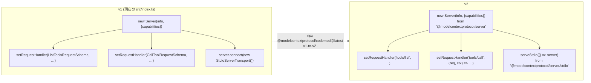
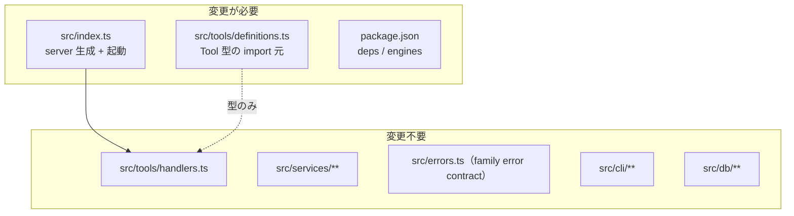
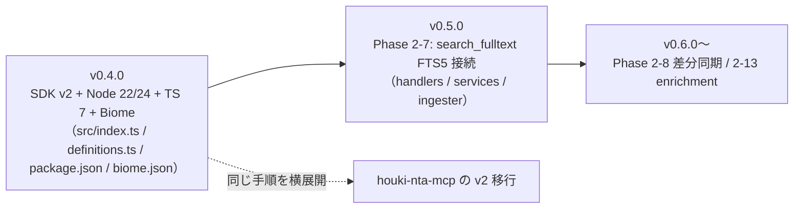

# MCP SDK v2 移行計画（houki-egov-mcp）

作成日: 2026-09-06 (JST) / 対象: v0.3.1 → 次リリース

## 1. 現状（2026-09-06 時点）

| 項目 | 状態 |
|---|---|
| ローカル `main` | `origin/main` と同期済み。未追跡ファイルは `docs/PHASE2-7-PLAN.md` のみ（コミットされていない） |
| 最新タグ / npm | `v0.3.1`（npm 公開 2026-07-14 03:50 JST）。GitHub の HEAD (`04c74da` plugin.json 追加) はタグ後のコミットで未公開 |
| `@modelcontextprotocol/sdk` | `^1.29.0`（インストール済み 1.29.0、v1 系の最新は 1.30.0） |
| TypeScript | `^5.7.0` |
| `engines.node` | `>=20.0.0`（手元の実行環境は Node v22.23.2 / npm 10.9.8） |
| SDK に触れているファイル | `src/index.ts`（`Server` / `StdioServerTransport` / `CallToolRequestSchema` / `ListToolsRequestSchema`）と `src/tools/definitions.ts`（`Tool` 型）の 2 ファイルだけ |
| CHANGELOG `[Unreleased]` | Phase 2-7 / 2-13 / 2-8 が残作業として列挙 |

補足: このセッションの実行環境（Linux VM）から `vitest` を起動すると `rollup/dist/native.js` の読み込みで失敗します。macOS 用にインストールされた `node_modules` を Linux から使うことが原因で、コードの不具合ではありません。テストの緑確認は Mac 側の `npm test` で行ってください（`node_modules` をこちらから再 build することはしません）。

## 2. MCP SDK v2 の要点

公開日は 2026-07-28 で、同日付の MCP 仕様改訂（2026-07-28 revision）と同時リリースです。v1（`@modelcontextprotocol/sdk`）は「v2 リリース後少なくとも 6 か月」（2027-01-28 頃まで）bug fix と security fix のみ受けます。

### 2.1 パッケージ構成

単一パッケージから分割されました。npm に公開済みのバージョンはいずれも `2.0.0` です。

| 用途 | パッケージ | 備考 |
|---|---|---|
| サーバー実装 | `@modelcontextprotocol/server` | `McpServer` / `Server` / `fromJsonSchema` / `ProtocolError`。`/stdio` サブパスに `serveStdio` |
| 型・スキーマ定数 | `@modelcontextprotocol/core` | v1 の `sdk/types.js` 相当（`Tool` 型など）。server が依存しているため直接 import するときだけ追加 |
| クライアント | `@modelcontextprotocol/client` | テストで `InMemoryTransport` / `Client` を使うときに devDependency |
| Node HTTP | `@modelcontextprotocol/node` | Streamable HTTP 用。stdio 専用の本 MCP には不要 |

要件: `engines.node >= 20`、`zod ^4.2.0`（server / core の通常依存として入る。zod 3 系は `tools/list` の初回応答で実行時エラー）。ESM を主としつつ CJS も同梱されているため、`"type": "module"` の本プロジェクトはそのまま使えます。

### 2.2 API の変更（本プロジェクトに関係する範囲）



| 変更点 | v1 | v2 |
|---|---|---|
| ハンドラ登録のキー | Zod スキーマ（`CallToolRequestSchema`） | メソッド名の文字列（`'tools/call'`） |
| ハンドラ第 2 引数 | `extra`（`extra.signal` など） | `ctx`（`ctx.mcpReq.signal` / `ctx.mcpReq.id`） |
| stdio 起動 | `await server.connect(new StdioServerTransport())` | `serveStdio(factory)`。factory は接続ごとに呼ばれ、戻り値は `close()` を持つ `StdioServerHandle` |
| 高レベル API | `server.tool()` | 廃止。`registerTool(name, config, handler)`。`inputSchema` は Standard Schema（zod v4 など）。JSON Schema のままなら `fromJsonSchema()` で包む |
| エラークラス | `McpError` | `ProtocolError`（wire を越える）と `SdkError`（ローカル）に分離 |
| 低レベル `Server` | あり | あり（`@modelcontextprotocol/server`）。`capabilities` を明示しないと `setRequestHandler('tools/list')` が throw する |

`serveStdio` の引数はサーバー本体ではなく **factory 関数** です。「`serveStdio(createServer)`」という書き方は、`createServer` を「引数なしで `Server` または `McpServer` を返す関数」として定義すれば公式ドキュメントの推奨形そのものになります。

### 2.3 2026-07-28 仕様改訂と stdio ツールサーバーの関係

公式の移行ガイドは「stdio 専用のツールサーバーは、`server.connect(new StdioServerTransport())` を `serveStdio(() => buildServer())` に置き換えるだけでよい」としています。`serveStdio` が起動時に protocol version の交渉を行い、2025 系クライアント（現行の Claude Desktop など）と 2026-07-28 系クライアントの両方に同じ factory で応答します。`inputRequired` / `requestState` / `cacheHints` といった新機能は elicitation や HTTP を使うサーバー向けで、本 MCP（tools のみ、stdio のみ）では採用不要です。

## 3. 影響範囲



`src/index.ts` の `tools/call` ハンドラに置いている family error contract（`UNKNOWN_TOOL` / `INTERNAL_ERROR` の JSON 化と `isError: true`）は、低レベル `Server` を使い続ける限りそのまま残せます。Phase 2-7 が触る `handlers.ts` / `services/` とは重なりません。

## 4. 移行手順（推奨: 低レベル `Server` を維持する最小変更）

### Step 1: 依存関係の入れ替え

```bash
npm rm @modelcontextprotocol/sdk
npm i @modelcontextprotocol/server
npm i -D @modelcontextprotocol/client   # InMemoryTransport でのテスト用（任意）
npx @modelcontextprotocol/codemod@latest v1-to-v2 .   # ルートで実行（src だけにしない）
```

codemod は import 先の書き換えと `setRequestHandler` のキー変換など機械的な置換を担当します。置換できなかった箇所には `@mcp-codemod-error` コメントが残るので、そこを手で直します。

### Step 2: `src/index.ts` の書き換え（目標形）

```ts
import { Server } from '@modelcontextprotocol/server';
import { serveStdio } from '@modelcontextprotocol/server/stdio';

export function createServer(): Server {
  const server = new Server(
    { name: PACKAGE_INFO.name, version: PACKAGE_INFO.version },
    { capabilities: { tools: {} } }   // 省略すると setRequestHandler が throw する
  );
  server.setRequestHandler('tools/list', async () => ({ tools }));
  server.setRequestHandler('tools/call', async (request) => {
    // 現在の try/catch と family error contract をそのまま移す
  });
  return server;
}

async function main() {
  const cliResult = await runCli(process.argv);
  if (!shouldFallbackToMcp(cliResult)) process.exit(cliResult.exitCode);

  const handle = serveStdio(createServer);
  process.on('SIGINT', () => { void handle.close(); });
  logger.info('server', `${PACKAGE_INFO.name} v${PACKAGE_INFO.version} started`);
}
```

`createServer` を export しておくと、テストから `InMemoryTransport.createLinkedPair()` で同じサーバーを in-process 起動できます（`client.callTool({ name, arguments })` の応答で `isError` と JSON 本文を検証）。現在 `handlers.test.ts` はハンドラ関数を直接呼んでいるので、この統合テストは追加であって置き換えではありません。

### Step 3: `src/tools/definitions.ts`

`import type { Tool } from '@modelcontextprotocol/sdk/types.js'` を `@modelcontextprotocol/core` からの import に変更します（codemod が書き換える想定。書き換わらなければ `@modelcontextprotocol/core` を dependencies に追加）。JSON Schema で書いた `inputSchema` は低レベル `Server` の `tools/list` 応答としてそのまま返せます。

### Step 4: `package.json`

| キー | 変更 |
|---|---|
| `dependencies` | `@modelcontextprotocol/sdk` → `@modelcontextprotocol/server ^2.0.0` |
| `engines.node` | `>=22.0.0`（Node 20 は 2026-04-30 に EOL。SDK 自体は `>=20`） |
| `devDependencies` | `@types/node` を `^24` に上げると Node 24 の型が使える（22 のままでも動作する）。lint / TS の変更は §5.2 |

### Step 5: 動作確認

1. `npm run build && npm test`（Mac 側）
2. `npx @modelcontextprotocol/inspector node ./dist/index.js` で `tools/list` と `search_law` を手動確認
3. Claude Desktop の `houki-egov-local` 設定（`dist/index.js` 直叩き）で 7 ツールが列挙されることを確認
4. `houki-egov-mcp --status` など CLI モードが従来どおり exit することを確認

### 4.1 `registerTool` へ移す案（今回は見送りを推奨）

`McpServer.registerTool(name, { inputSchema: fromJsonSchema(schema) }, handler)` に移すと、引数検証を SDK が行い、失敗時は SDK 生成の文言で `isError: true` を返します。この文言は family error contract（`code` / `hint` / `next_actions`）に従わないため、採用するなら「検証は自前で `fromJsonSchema(...)['~standard'].validate()` を呼び、失敗時に `INVALID_ARGS` 相当の JSON を返す」形にする必要があります。7 ツール分の書き換えになり Phase 2-7 の handler 変更と重なるので、今回の移行では低レベル `Server` を維持し、`registerTool` 化は Phase 2-7 完了後の別タスクとします。

## 5. TypeScript 7 の判断 — lint を Biome に替えて今すぐ 7 系にする

TS 7.0.2 が typescript-eslint と同居できない原因は、TS 7.0 が Programmatic Compiler API を同梱していないことです（typescript-eslint 8.69.0 の peer は `typescript >=4.8.4 <6.1.0`。7.1 で API が戻る予定）。Biome は Rust 製の独自パーサーで TypeScript パッケージに依存しないため、lint / format を Biome に替えれば TS 7 を今すぐ採用できます。epsg-mcp が既に `typescript ^7.0.2` + `@biomejs/biome ^2.5.12` で動いているので、その構成をそのまま持ち込みます。vitest は esbuild で変換するため TS 7 の影響を受けません。

本プロジェクトの `tsconfig.json`（`module: NodeNext` / `esModuleInterop: true` / `baseUrl` なし）は TS 6 / 7 で削除された設定を使っていないので、設定変更は不要です。

### 5.1 現行 src に Biome 2.5.12 を当てた結果（2026-09-06、epsg-mcp の biome.json を流用）

| 項目 | 結果 |
|---|---|
| `biome format`（`indentStyle` を `space` に変えた状態） | **差分 0 ファイル**。現在の `.prettierrc`（single quote / es5 / semi / width 100 / 2 space）と一致するため、Prettier を外しても再フォーマットのコミットは発生しない |
| `biome lint` | 39 ファイル、error 2 / warning 1 / info 20 |
| 自動修正できるもの（FIXABLE） | `complexity/useLiteralKeys` ×14（`law-hierarchy.test.ts` の `obj['key']` 記法）、`style/useTemplate` ×3（`csv-parser.test.ts` の文字列連結）、`style/useNodejsImportProtocol` ×1（`config.ts` L6 を `node:` 付き import に） |
| 手で直すもの | `suspicious/noImplicitAnyLet`（`cli/index.ts` L199、`let` に型注釈を付ける）、`suspicious/noExplicitAny`（`handlers.ts` L146 の `toolHandlers` の `any`。eslint でも warn だったもの） |
| 全角スペース（U+3000） | 文字列・テンプレート・コメント・正規表現の中は **指摘しない**（実機で確認）。コード部分の U+3000 だけ `suspicious/noIrregularWhitespace` が warn する。eslint で `skipComments` / `skipRegExps` / `skipTemplates` を付けていた意図がそのまま既定で満たされるので、追加設定は不要 |
| 型情報を使うルール | 現行の eslint 設定は `parserOptions.project` を指定しているが、有効にしているルールに型情報を使うものはない。Biome へ移しても失うルールはない |

eslint との差は 1 点だけです。eslint は非テストファイルの通常の文字列リテラル内の U+3000 も指摘していましたが（`skipStrings` 未指定）、Biome は指摘しません。法令テキストを文字列に持つ本プロジェクトでは、この差は許容できます。

### 5.2 変更内容

`biome.json`（epsg-mcp のものを基に `indentStyle` だけ変更）:

```json
{
  "$schema": "https://biomejs.dev/schemas/2.5.12/schema.json",
  "vcs": { "enabled": true, "clientKind": "git", "useIgnoreFile": true },
  "files": { "ignoreUnknown": false, "includes": ["src/**", "*.ts", "*.json", "*.md"] },
  "formatter": { "enabled": true, "indentStyle": "space", "indentWidth": 2, "lineWidth": 100 },
  "linter": {
    "enabled": true,
    "rules": { "recommended": true, "style": { "noNonNullAssertion": "off" } }
  },
  "javascript": {
    "formatter": { "quoteStyle": "single", "trailingCommas": "es5", "semicolons": "always" }
  },
  "json": { "formatter": { "trailingCommas": "none" } }
}
```

`package.json`:

| 対象 | 変更 |
|---|---|
| 削除 | `eslint` / `@eslint/js` / `typescript-eslint` / `eslint-config-prettier` / `prettier`、`eslint.config.js`、`.prettierrc` |
| 追加 | `@biomejs/biome ^2.5.12` |
| `typescript` | `^7.0.2` |
| `scripts` | `"lint": "biome lint src"`、`"format": "biome format --write src"`、`"check": "biome check --write src"`、`"format:check": "biome format src"` |

手順は「`npm i -D @biomejs/biome@^2.5.12 typescript@^7 && npm rm eslint @eslint/js typescript-eslint eslint-config-prettier prettier` → `biome.json` 配置 → `npx biome check --write src`（自動修正 18 件）→ 残り 2 件を手修正 → `npm run build && npm test`」です。エディタは VS Code の Biome 拡張に切り替えます（`tsserver` は TS 7 で LSP に置き換わっていますが、VS Code の TypeScript 拡張は自前の TS を同梱しているため補完は従来どおり動きます）。

houki-nta-mcp（eslint + prettier、TS `^5.7.0`）にも同じ手順を横展開できます。

## 6. Node の基準

`engines.node` を `>=22.0.0` にし、CI のマトリクスは 22 と 24 の 2 本にします。`better-sqlite3` はネイティブモジュールなので、Node 24 で `npm install` が通ること（prebuilt binary の有無）を CI で確認してください。

## 7. Phase 2-7 との順序

結論: **SDK v2 移行を先に、独立した小さなリリースとして出す**ことを推奨します。



理由は次の 4 点です。

1. 変更範囲が重ならない。v2 移行は `index.ts` と `definitions.ts` の import 1 行、Phase 2-7 は `handlers.ts` / `services/`。先に済ませても Phase 2-7 の計画書（Step 1〜7）は 1 行も変わりません。
2. v2 移行のほうが小さい（作業量は半日以内、Phase 2-7 は「nta からの移植 + 新規設計 2 点 + テスト約 30 件」）。小さいほうを先に出すと、問題が出たときに原因を SDK 側か FTS 側かで切り分けられます。
3. Phase 2-7 で追加するテスト（`handlers.test.ts` の追記）を、v2 で export する `createServer` + `InMemoryTransport` の統合テスト基盤の上に書けます。逆順だと Phase 2-7 のテストを書いた後で起動部分を差し替えることになります。
4. houki-nta-mcp も `@modelcontextprotocol/sdk ^1.29.0` のままです。egov で確立した手順（codemod → `serveStdio(createServer)` → InMemoryTransport テスト）を nta と family の他の MCP に横展開する起点になります。v1 の保守期限（2027-01-28 頃）から逆算しても、先に片付けるほうが安全です。

一方で、リリース済みの `docs/PHASE2-7-PLAN.md` は「v0.3.1 → v0.4.0」と書いています。上の案ではバージョンがずれるので、次のどちらかを選んでください。

| 案 | 内容 |
|---|---|
| A（推奨） | v0.4.0 = SDK v2 移行、v0.5.0 = Phase 2-7。`PHASE2-7-PLAN.md` の対象バージョンを v0.5.0 に書き換える |
| B | v0.4.0 に両方を入れる。ブランチを分けて先に v2 移行をマージし、Phase 2-7 を後から重ねる。リリースは 1 回で済むが、不具合時の切り分けが難しくなる |

## 8. 完了判定（v2 移行）

- [ ] `package.json` に `@modelcontextprotocol/sdk` が残っていない
- [ ] `npm run build` / `npm test` / `npm run lint` が Node 22 と 24 の両方で通る
- [ ] MCP Inspector で `tools/list` が 7 ツールを返す
- [ ] `tools/call` に存在しないツール名を渡すと、従来どおり `UNKNOWN_TOOL` の JSON と `isError: true` が返る
- [ ] `houki-egov-mcp --status` が MCP サーバーを起動せずに exit する
- [ ] `npx biome check src` が error 0 で通る
- [ ] CHANGELOG `[0.4.0]` に Changed（SDK v2 / Node >=22 / TS 7 / eslint + prettier → Biome）を記載

## 参考

- v2 ドキュメント: https://ts.sdk.modelcontextprotocol.io/v2/
- 移行ガイド: https://ts.sdk.modelcontextprotocol.io/v2/migration/upgrade-to-v2.html
- 2026-07-28 仕様改訂の採用ガイド: https://ts.sdk.modelcontextprotocol.io/v2/migration/support-2026-07-28.html
- stdio: https://ts.sdk.modelcontextprotocol.io/v2/serving/stdio.html
- 低レベル Server: https://ts.sdk.modelcontextprotocol.io/v2/advanced/low-level-server.html
- テスト: https://ts.sdk.modelcontextprotocol.io/v2/testing.html
- TS 7 と typescript-eslint の状況: https://ortamarco.me/en/blog/what-breaks-upgrading-to-typescript-7/ / https://loke.dev/writing/typescript-7-typescript-eslint-side-by-side
