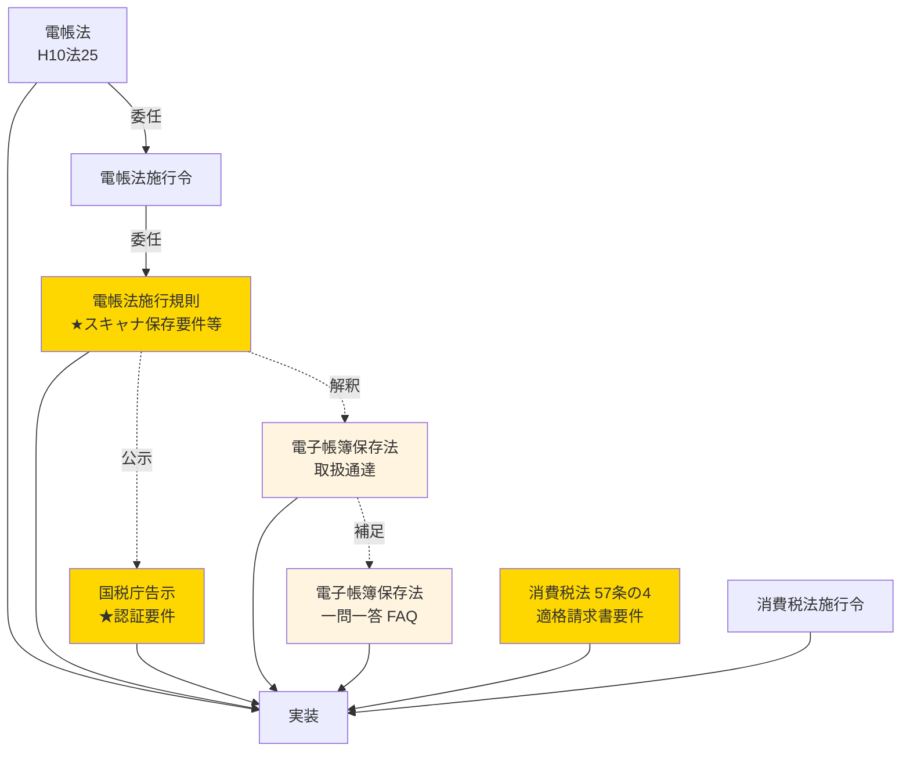
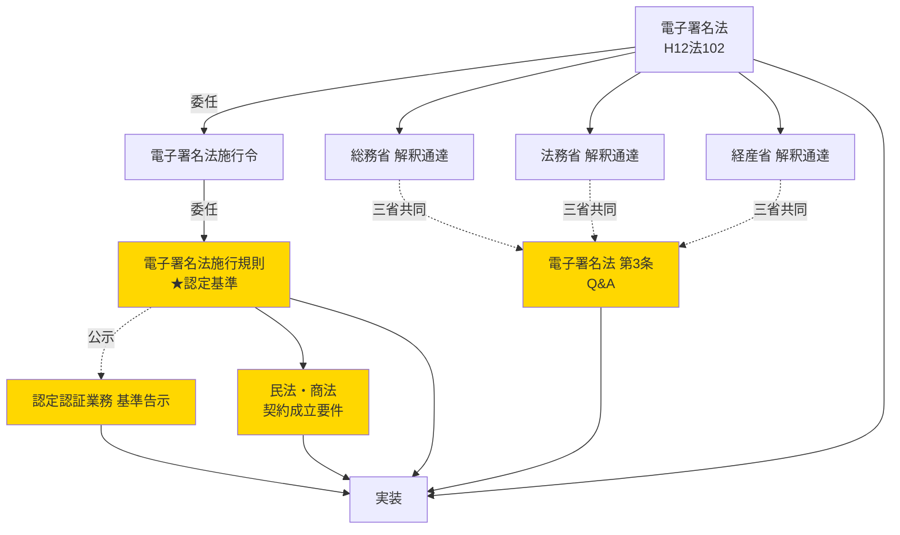
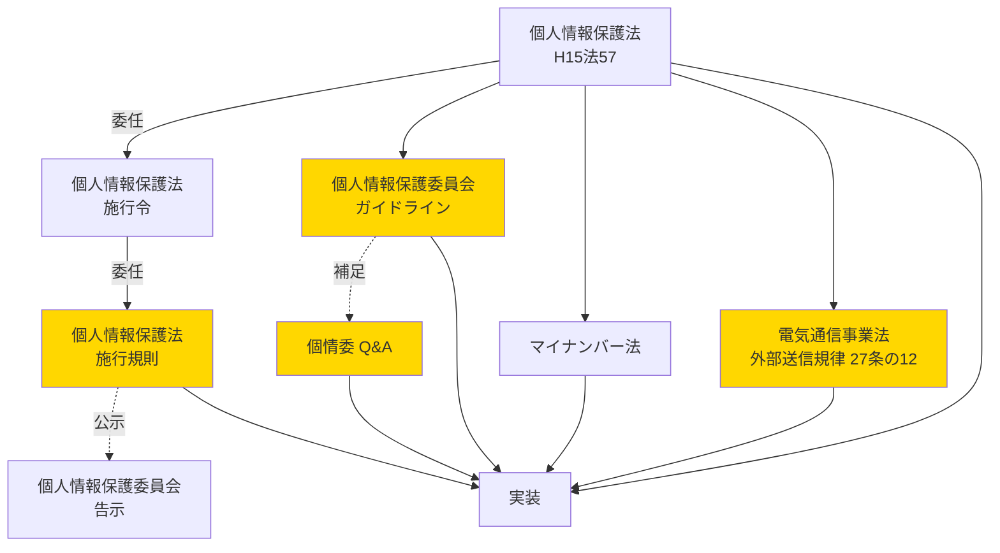
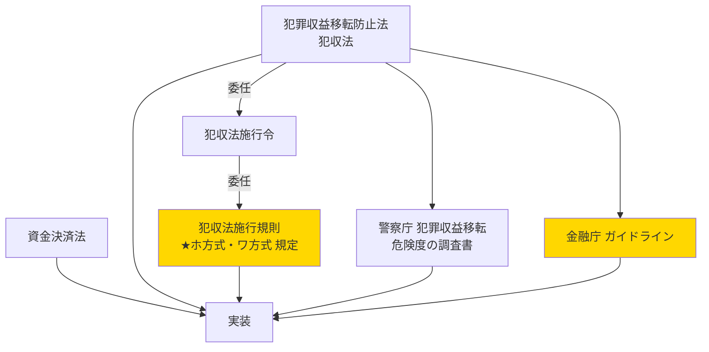

# プロダクト開発における houki-egov-mcp ユースケース集

「請求書を電子化して」「本人確認を実装して」のようなオーナーからの実装依頼の背後には、複数省庁にまたがる法令調査が潜んでいます。各ユースケースで houki-egov-mcp が**どのレイヤー**を提供し、**どこから先は有資格者の領域**かを示します。

---

## 1. 電子帳簿保存法（電帳法）対応の実装

### 想定される実装依頼

> 「うちの会計システム、電帳法対応してくれる？ あとインボイス対応もよろしく」

### 必要な情報レイヤー



### houki-egov-mcp での取得経路

| レイヤー | houki-egov-mcp ツール | データ取得元 |
|---|---|---|
| 法律本文 | `get_law("電帳法")` | e-Gov（Phase 1） |
| 施行令・施行規則 | `get_law("電帳法施行規則")` | e-Gov（Phase 1） |
| インボイス関連条文 | `get_law("消法", { article: "57の4" })` | e-Gov（Phase 1） |
| 国税庁告示 | `get_law(...)` または NTA直接 | e-Gov 一部 + `ext-nta`（Phase 3） |
| 取扱通達 | `nta_search({ type: "tsutatsu", keyword: "電帳法" })` | `@houki-egov/ext-nta`（Phase 3） |
| 一問一答 Q&A | `nta_search({ type: "qa", keyword: "電帳法" })` | `@houki-egov/ext-nta`（Phase 3） |
| 法令種別の解説 | `explain_law_type("施行規則")` | コア（Phase 0、実装済） |

### LLM プロンプト例

```
[利用者] 電帳法対応で、スキャナ保存の要件を教えて。
[LLM] (1) get_law("電帳法施行規則", { article: "2" }) で要件取得
       (2) nta_search({ type: "tsutatsu", keyword: "スキャナ保存" }) で取扱通達
       (3) nta_search({ type: "qa", keyword: "スキャナ保存" }) で一問一答
       これらを統合して回答案を作成
```

### どこから有資格者の領域か

- 個別の証憑が「電帳法 4条・5条のどの保存要件に該当するか」の判定 → **税理士の領域**
- 監査対応・税務調査での主張 → **税理士の領域**
- 実装してデプロイすることそのもの → **エンジニアの領域**（規制外）

---

## 2. 電子契約サービスの実装

### 想定される実装依頼

> 「うちのサービスに電子契約機能を追加。法的にちゃんとしたやつで」

### 必要な情報レイヤー



### houki-egov-mcp での取得経路

| レイヤー | houki-egov-mcp ツール | データ取得元 |
|---|---|---|
| 電子署名法本文 | `get_law("電子署名法", { article: "3" })` | e-Gov（Phase 1） |
| 施行令・規則 | `get_law("電子署名法施行規則")` | e-Gov（Phase 1） |
| 民法上の契約規定 | `get_law("民法", { article: "522" })` | e-Gov（Phase 1） |
| 認定基準告示 | `get_law(...)` | e-Gov 一部 + `ext-soumu`（Phase 3） |
| 三省共同 解釈通達 | `soumu_search` / `moj_search` / `meti_search` | `@houki-egov/ext-{soumu,moj,meti}`（Phase 3） |
| 立会人型 vs 当事者型 Q&A | 上記 ext の `type: "qa"` | 同上 |

### LLM プロンプト例

```
[利用者] 立会人型電子署名と当事者型電子署名の違いは？
[LLM] (1) get_law("電子署名法", { article: "3" }) で電子署名の効力規定
       (2) moj_search({ type: "qa", keyword: "立会人型" }) で法務省Q&A
       (3) explain_law_type("告示") で「告示」の法的位置付けの確認
       これらを統合して回答案を作成
```

### どこから有資格者の領域か

- 「うちのサービスは当事者型／立会人型のどちらか」の判定 → 法的アドバイスを得るなら**弁護士**
- 利用規約に電子契約条項を追加する起草 → **弁護士**（最終確認）／エンジニアは叩き台
- 認定認証業務として登録する手続 → **弁護士・行政書士**

---

## 3. プライバシーポリシー起草・個人情報保護対応

### 想定される実装依頼

> 「ユーザー登録機能を作るからプライバシーポリシーも書いてほしい」

### 必要な情報レイヤー



### houki-egov-mcp での取得経路

| レイヤー | houki-egov-mcp ツール | データ取得元 |
|---|---|---|
| 個情法本文 | `get_law("個情法", { article: "27" })` | e-Gov（Phase 1） |
| 施行令・規則 | `get_law("個情法施行規則")` | e-Gov（Phase 1） |
| 電気通信事業法 外部送信規律 | `get_law("電通事業法", { article: "27の12" })` | e-Gov（Phase 1） |
| マイナンバー法 | `get_law("マイナンバー法")` | e-Gov（Phase 1） |
| 個情委ガイドライン・Q&A | `ppc_search({ type: "guideline" })` | `@houki-egov/ext-ppc`（Phase 3） |
| 業法独占規定の確認 | `explain_business_law_restriction("弁護士")` | コア（Phase 0、実装済） |

### LLM プロンプト例

```
[利用者] うちのサービス、利用者情報を Cookie で取ってるけど何を書けばいい？
[LLM] (1) get_law("電通事業法", { article: "27の12" }) で外部送信規律の条文
       (2) ppc_search({ type: "guideline", keyword: "外部送信" }) で個情委ガイドライン
       (3) explain_law_type("ガイドライン") で法的位置付け
       これらを統合してプライバシーポリシー条項案を作成
```

### どこから有資格者の領域か

- プライバシーポリシーの最終チェック → **弁護士**
- 個人情報漏洩時の対応 → **弁護士・個人情報保護委員会への報告は事業者自身**
- 安全管理措置の実装 → **エンジニアの領域**（規制外）

---

## 4. e-KYC（オンライン本人確認）の実装

### 想定される実装依頼

> 「金融サービスやるから KYC 入れて。法律守りつつ UX も良くして」

### 必要な情報レイヤー



### houki-egov-mcp での取得経路

| レイヤー | houki-egov-mcp ツール | データ取得元 |
|---|---|---|
| 犯収法本文 | `get_law("犯収法", { article: "4" })` | e-Gov（Phase 1） |
| 犯収法施行規則 | `get_law("犯罪による収益の移転防止に関する法律施行規則")` | e-Gov（Phase 1） |
| 資金決済法 | `get_law("資金決済法")` | e-Gov（Phase 1） |
| 金融庁ガイドライン | `fsa_search({ keyword: "本人確認" })` | `@houki-egov/ext-fsa`（Phase 3） |

### どこから有資格者の領域か

- 特定事業者該当性の判定 → **弁護士・金融庁への確認**
- KYC運用フローの設計 → **法律事務所のリーガルチェック**
- AML/CFT 体制構築 → **弁護士・コンプライアンス専門会社**
- 実装そのもの → **エンジニアの領域**（規制外）

---

## 共通の利用パターン

### 「3ステップ」で houki-egov-mcp を使う

1. **`explain_law_type` / `explain_business_law_restriction`** で**地形把握**（このレイヤーは何？業法に抵触しないか？）
2. **`get_law` / `search_law`** で**条文取得**（事実情報の収集）
3. **`{namespace}_search` / `{namespace}_get`**（Phase 3）で**実務基準の補完**（通達・Q&A・ガイドライン）

LLM はこれらを統合して論点整理・初稿作成を行い、利用者は最終判断（必要なら有資格者へ）を行います。

### 「3層責任分離」を常に守る

```
┌─────────────────────────────────────┐
│ 利用者         最終判断と責任         │
│  ↑                                   │
│ LLM           事実からの分析・論点整理 │
│  ↑                                   │
│ houki-egov-mcp 一次情報の取得・提示のみ │
└─────────────────────────────────────┘
```

**houki-egov-mcp は「叩き台のコストを下げる」道具**。最終判断と責任は利用者と有資格者にあります。詳細は [DISCLAIMER.md](../DISCLAIMER.md) 参照。

---

## 関連ドキュメント

- [README.md](../README.md) — プロジェクト概要・想定利用シーン
- [DISCLAIMER.md](../DISCLAIMER.md) — 3層責任分離・業法との関係
- [docs/LAW-HIERARCHY.md](LAW-HIERARCHY.md) — 法令種別の詳細
- [docs/IMPLEMENTATION-PLAN.md](IMPLEMENTATION-PLAN.md) — Phase 1〜3 計画
- [docs/DESIGN.md](DESIGN.md) — 設計原則・拡張ロードマップ
